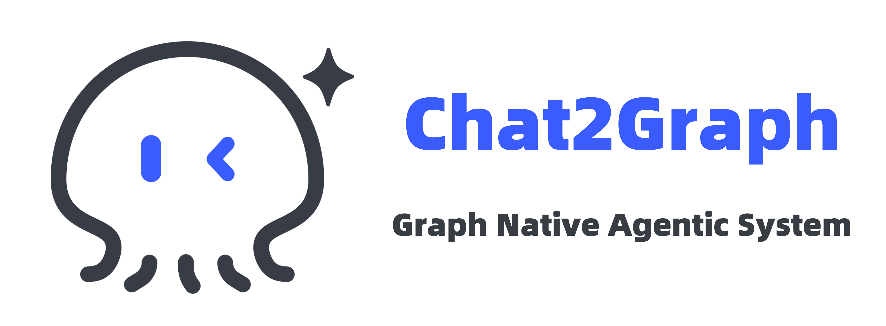

🌐️ English | [中文](doc/README-cn.md)

<p align="center">
  
</p>


[](https://github.com/TuGraph-family/chat2graph/stargazers)
[](https://github.com/TuGraph-family/chat2graph/forks)
[](https://github.com/TuGraph-family/chat2graph/contributors)
[](https://github.com/TuGraph-family/chat2graph/commits/master)
[](https://www.apache.org/licenses/LICENSE-2.0.html)
[](https://github.com/TuGraph-family/chat2graph/releases)

## Background

Traditional tabular data processing technologies, such as distributed databases, data warehouses, 
and data lakes, have been continuously evolving and gradually maturing. In comparison, graph-based 
data processing technologies (graph databases, graph computing engines) provide new ideas and 
methods, but also face issues such as low ecological maturity and high barriers to product usage. 
With the rise of large language models (LLMs), how to effectively combine artificial intelligence 
technology with graph computing technology (Graph + AI) will be a very worthwhile direction to 
explore. On one hand, we can leverage cutting-edge technologies like LLMs and agents to 
lower the barriers to using graph computing products and enhance the user experience with graphs. 
On the other hand, graph computing technology can fully utilize the performance and 
interpretability advantages of graph data structures in relational analysis scenarios, assisting 
LLMs and intelligent agents in improving reasoning capabilities and generation quality.

## Introduction

Chat2Graph builds a multi-agent system (MAS) on top of a graph database to achieve intelligent 
capabilities in research and development, operations and maintenance, Q&A, generation, and more, 
helping users, developers, product managers, solution architects, operations engineers, and others 
to efficiently use graph databases, lower the barriers to using graphs, and accelerate content 
generation, implement dialogue with graphs. At the same time, leveraging the inherent advantages 
of graph data structures in relationship modeling, interpretability, etc., can enhance the key 
capabilities of intelligent agents such as reasoning, planning, memory, and tools, to achieve 
a deep integration of graph computing technology and artificial intelligence technology.

## Key Features

Chat2Graph currently provides basic capabilities of intelligent agent systems, but there are 
still many features that need to be improved together with the community.

- [x] One-active-Many-Passive mixed multi-agent architecture.
- [x] Dual-LLM reasoning machine combining fast and slow thinking.
- [x] Task decomposition and graph planner oriented towards intelligent agent chains.
- [x] Hierarchical memory system.
- [x] Toolkit knowledge graph.
- [x] Vector and graph knowledge base.
- [x] Concise intelligent agent SDK.
- [x] Service-oriented and web interaction.
- [x] One-click configuration of agents.
- [ ] Structured agent role management.
- [ ] Workflow auto-generation.
- [ ] Operator layer action recommendation.
- [ ] Toolkit graph optimizer.
- [ ] Environmental information management.
- [ ] Agent task compiler.
- [ ] Unified resource manager.
- [ ] Tracking and control capabilities.
- [ ] Rich toolkit/MCP integration.
- [ ] Benchmark.
- [ ] Access to mainstream open-source ecosystems.
- [ ] Multimodal capabilities.
- [ ] Production enhancement.


## Quick Start

### Preparation

Prepare the required versions of Python and NodeJS.

* Install Python: [Python == 3.10](https://www.python.org/downloads) recommended.
* Install NodeJS: [NodeJS >= v20](https://nodejs.org/en/download) recommended.

You can also use tools like [conda][conda] to install the python environment.

### Build & Start

Build Chat2Graph as follows.

```bash
git clone https://github.com/TuGraph-family/chat2graph.git
cd chat2graph
./bin/build.sh
```

Then configure environment variables (e.g., LLM parameters) based on 
[.env.template](.env.template), startup Chat2Graph.

```bash
cp .env.template .env && vim .env
./bin/start.sh
```

When you see the following log, you can access Chat2Graph in the browser at 
[http://localhost:5000/](http://localhost:5000/).

```text
Starting server...
Web resources location: /Users/florian/code/chat2graph/app/server/web
Prepare database tables ...
Loading AgenticService from app/core/sdk/chat2graph.yml with encoding utf-8
Init application: Chat2Graph
Init the Leader agent
Init the Expert agents

  ____ _           _   ____   ____                 _     
 / ___| |__   __ _| |_|___ \ / ___|_ __ __ _ _ __ | |__  
| |   | '_ \ / _` | __| __) | |  _| '__/ _` | '_ \| '_ \ 
| |___| | | | (_| | |_ / __/| |_| | | | (_| | |_) | | | |
 \____|_| |_|\__,_|\__|_____|\____|_|  \__,_| .__/|_| |_|
                                            |_|          

 * Serving Flask app 'bootstrap'
 * Debug mode: off
WARNING: This is a development server. Do not use it in a production deployment. Use a production WSGI server instead.
 * Running on http://127.0.0.1:5000
Press CTRL+C to quit

```

### Use SDK

The SDK of Chat2Graph provides a very clear and concise API, allowing you to easily build access 
to your intelligent system.

You can quickly converse with the built-in Chat2Graph in the following ways.

```python
SystemEnv.LLM_NAME="gpt-4o-mini"
SystemEnv.LLM_ENDPOINT="https://api.openai.com/v1"
SystemEnv.LLM_APIKEY="<YOUR-OPENAI-API-KEY>"

mas = AgenticService.load()
question = TextMessage(payload = "What is TuGraph ?")
answer = mas.execute(question).get_payload()
```

At the same time, the SDK also provides asynchronous dialogue capabilities.

```python
job = mas.session().submit(question)
answer = job.wait().get_payload()
```

Of course, customizing your own intelligent agent is also allowed.

```python
mas = AgenticService("Chat2Graph")
mas.expert(name="Graph Modeling Expert").workflow(
        (analysis_operator, concept_modeling_operator)
    ).build()
```

To facilitate the rapid configuration of agents, you can describe the details of the agent 
using a YAML file and load it directly.

```python
mas = AgenticService.load("app/core/sdk/chat2graph.yml")
```

## Contributing

You can reference [Contributing][contrib] document and submit GitHub Issues/PRs 
to provide feedback and suggest improvements for Chat2Graph.

## Contact

You can contact with us directly through TuGraph Discord and WeChat group provided below.

- WeChat：


- Discord：https://discord.gg/KBCFbNFj

[conda]: https://docs.conda.io/projects/conda/en/latest/user-guide/install/index.html
[contrib]: https://github.com/TuGraph-family/community/blob/master/docs/CONTRIBUTING.md
