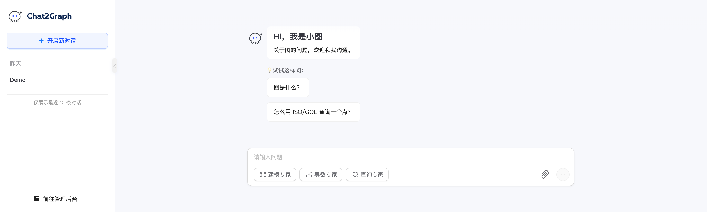
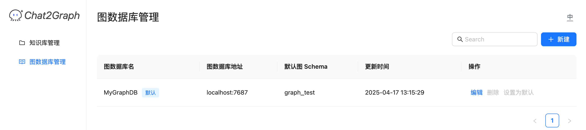

🌐️ 中文 | [English](../README.md)

<p align="center">
  
</p>

[](https://github.com/TuGraph-family/chat2graph/stargazers)
[](https://github.com/TuGraph-family/chat2graph/forks)
[](https://github.com/TuGraph-family/chat2graph/contributors)
[](https://github.com/TuGraph-family/chat2graph/commits/master)
[](https://www.apache.org/licenses/LICENSE-2.0.html)
[](https://github.com/TuGraph-family/chat2graph/releases)

## 背景

传统的基于表格的数据处理技术，如分布式数据库、数据仓库、数据湖等，一直在持续演进并逐步走向成熟。相比而言，
基于图的数据处理技术（图数据库、图计算引擎）提供了新型的思路和方法的同时，也面临着生态成熟度低、产品使用
门槛高等问题。随着大语言模型的兴起，如何有效地将人工智能技术与图计算技术相结合（Graph + AI），将是非常
值得探索的方向。一方面我们可以借助大模型、 智能体等前沿技术降低图计算产品的使用门槛，提升用户的用图体验。
另一方面，图计算技术可以充分发挥图数据结构在关联性分析场景上的性能与可解释性优势，协助大模型、智能体提升
推理能力以及生成质量。

## 简介

Chat2Graph 通过构建图数据库上的多智能体系统，实现智能化的研发、运维、问答、生成等多样化能力，帮助
用户、开发者、产品经理、解决方案架构师、运维工程师等高效使用图数据库，降低用图门槛，加速内容生成，
实现与图对话。同时利用图数据结构的关系建模、可解释性等天然优势，可以对智能体的推理、规划、记忆、工具等
关键能力进行增强，做到图计算技术与人工智能技术的深度融合。

## 关键特性

Chat2Graph 目前提供了基础的智能体系统能力，仍有诸多特性需要和社区一起完善。

- 推理 && 规划
  - [x] 单主动多被动混合多智能体架构。
  - [x] 快&慢思考结合的双LLM推理机。
  - [x] 面向智能体链（CoA）的任务分解与图规划器。
  - [ ] 工作流自动生成。
  - [ ] 算子动作推荐。
  - [ ] 结构化智能体角色管理。
  - [ ] 智能体任务编译器。
- 记忆 && 知识
  - [x] 分层记忆系统。
  - [x] 向量与图谱知识库。
  - [ ] 知识精炼机制。
  - [ ] 环境管理。
- 工具 && 系统
  - [x] 工具知识图谱。
  - [ ] 工具图谱优化器。
  - [ ] 丰富的工具集与MCP集成。
  - [ ] 统一资源管理器。
  - [ ] 跟踪与管控能力。
  - [ ] Benchmark测试。
- 产品 && 生态
  - [x] 简洁的智能体SDK。
  - [x] Web服务化与交互。
  - [x] 智能体一键配置。
  - [ ] 多模态能力。
  - [ ] 产品化增强。
  - [ ] 开源生态集成。


## 快速开始

### 准备环境

准备符合要求的 Python 和 NodeJS 版本。

* Install Python: 推荐 [Python == 3.10](https://www.python.org/downloads)。
* Install NodeJS: 推荐 [NodeJS >= v16](https://nodejs.org/en/download)。

你也可以使用 [conda][conda] 等工具安装Python环境。

### 构建启动

按照如下方式构建 Chat2Graph。

```bash
git clone https://github.com/TuGraph-family/chat2graph.git
cd chat2graph
./bin/build.sh
```

然后基于 [.env.template](../.env.template) 配置环境变量（如 LLM 参数），启动 Chat2Graph。

```bash
cp .env.template .env && vim .env
./bin/start.sh
```

当看到如下日志后：

```text
Starting server...
Web resources location: /Users/florian/code/chat2graph/app/server/web
System database url: sqlite:////Users/florian/.chat2graph/system/chat2graph.db
Loading AgenticService from app/core/sdk/chat2graph.yml with encoding utf-8
Init application: Chat2Graph
Init the Leader agent
Init the Expert agents
  ____ _           _   ____   ____                 _     
 / ___| |__   __ _| |_|___ \ / ___|_ __ __ _ _ __ | |__  
| |   | '_ \ / _` | __| __) | |  _| '__/ _` | '_ \| '_ \ 
| |___| | | | (_| | |_ / __/| |_| | | | (_| | |_) | | | |
 \____|_| |_|\__,_|\__|_____|\____|_|  \__,_| .__/|_| |_|
                                            |_|          

 * Serving Flask app 'bootstrap'
 * Debug mode: off
WARNING: This is a development server. Do not use it in a production deployment. Use a production WSGI server instead.
 * Running on all addresses (0.0.0.0)
 * Running on http://127.0.0.1:5010
 * Running on http://192.168.1.1:5010
Chat2Graph server started success ! (pid: 16483)
```

你可以在浏览器访问 [http://localhost:5010/](http://localhost:5010/) 使用 Chat2Graph。



## 注册图数据库

在「管理后台」注册图数据库到Chat2Graph后，可以体验完整的「与图对话」的能力。


当前支持的图数据库类型有：
* Neo4j

```bash
docker pull neo4j:latest
docker run -d -p 7474:7474 -p 7687:7687 --name neo4j-server --env NEO4J_AUTH=none neo4j:latest
```

* TuGraph

```bash
docker pull tugraph/tugraph-runtime-centos7:4.5.1
docker run -d -p 7070:7070 -p 7687:7687 -p 9090:9090 --name tugraph-server \
  tugraph/tugraph-runtime-centos7:latest lgraph_server -d run --enable_plugin true
```


### 使用SDK

Chat2Graph 的 SDK 提供了非常清晰简洁的 API，让你轻松构建访问你的智能体系统。

通过以下方式，可以快速与内置的Chat2Graph进行对话。

```python
SystemEnv.LLM_NAME="gpt-4o-mini"
SystemEnv.LLM_ENDPOINT="https://api.openai.com/v1"
SystemEnv.LLM_APIKEY="<YOUR-OPENAI-API-KEY>"

mas = AgenticService.load()
question = TextMessage(payload = "What is TuGraph ?")
answer = mas.execute(question).get_payload()
```

同时，SDK也提供了异步对话能力。

```python
job = mas.session().submit(question)
answer = job.wait().get_payload()
```

当然，定制自己的智能体也是允许的。

```python
mas = AgenticService("Chat2Graph")
mas.expert(name="Design Expert").workflow(
        (analysis_operator, concept_modeling_operator)
    ).build()
```

为了方便智能体的快速配置，可以使用YAML文件描述智能体细节后，直接加载。

```python
mas = AgenticService.load("app/core/sdk/chat2graph.yml")
```

## 贡献
您可以参考[贡献文档][contrib]，提交 GitHub Issue/PR 提供反馈建议对 Chat2Graph 继续改进。
TuGraph 为社区制定了清晰的[架构][arch]和[角色][roles]，并会邀请优秀贡献者加入[特别兴趣小组][sigs]。

## 联系
您可以通过下面提供的 TuGraph 微信群或 Discord 与我们直接联系。

- 微信：

- Discord：https://discord.gg/KBCFbNFj

[conda]: https://docs.conda.io/projects/conda/en/latest/user-guide/install/index.html
[contrib]: https://github.com/TuGraph-family/community/blob/master/docs/CONTRIBUTING-cn.md
[arch]: https://github.com/TuGraph-family/community/blob/master/assets/arch.png
[roles]: https://github.com/TuGraph-family/community/blob/master/docs/ROLES-cn.md
[sigs]: https://github.com/TuGraph-family/community/blob/master/docs/SIGS-cn.md