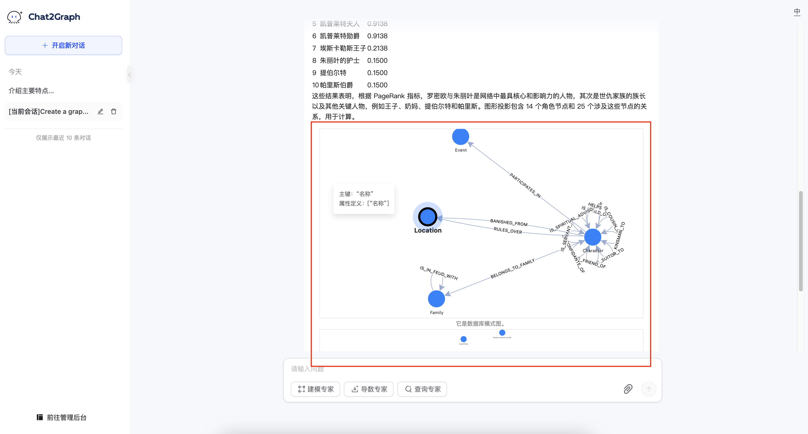

# 聊天

## 界面概览

主界面分为三个主要部分：

* **左侧边栏：** 包含会话管理选项和历史记录。
* **主聊天区：** 显示正在进行的对话和您的请求状态。
* **输入区：** 您在此处输入指令并选择专家模式。

    

* **图表显示：** 在使用 Chat2Graph 操作图数据库的过程中，它甚至可以渲染所涉及的图，提供了非常好的可视化功能。

    

## 如何使用

1. **开始对话：** 点击“+ 开启新对话”或从历史记录中选择一个现有对话。
2. **选择专家模式：** 选择最适合您任务的专家（设计、提取或查询）（下一版本支持）。
3. **输入您的请求：** 在“请输入内容”字段中输入您的指令或问题。请尽可能清晰和具体。
4. **（可选）添加附件：** 如果需要，点击回形针图标上传相关文件。
5. **提交：** 点击发送按钮。
6. **监控进度：** 在主聊天区观察状态更新（运行中、规划中、分析中等）。
7. **查看结果：** 处理完成后，结果将显示在主聊天区。然后您可以提出后续问题或开始新的请求。
