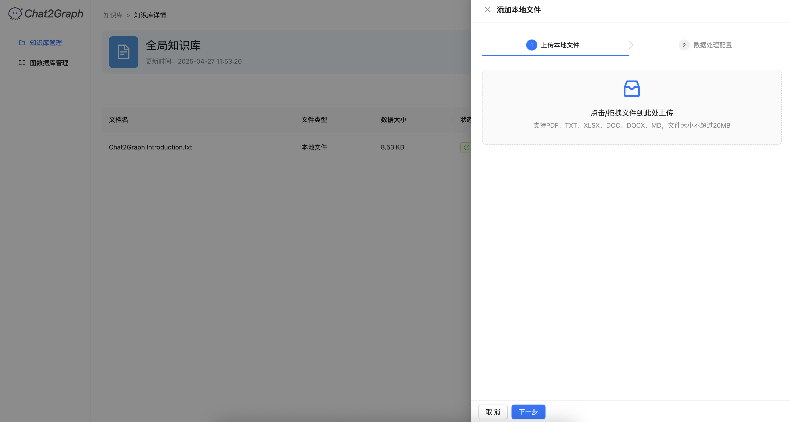
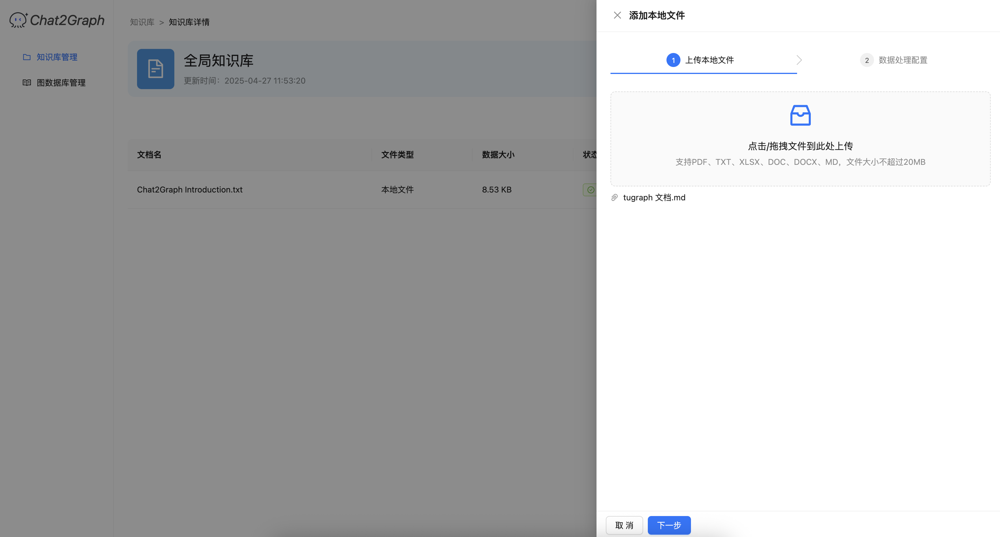
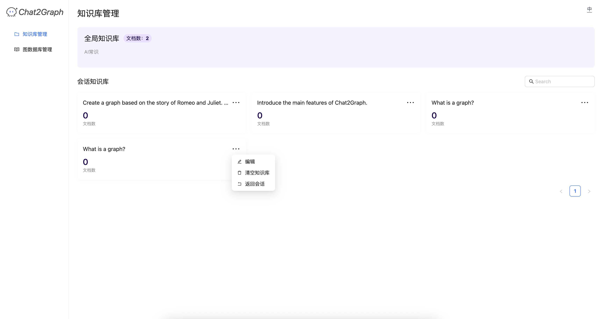

# 知识库

Chat2Graph的知识库在使用上分为全局知识库及会话知识库两部分，

+ **全局知识库**：全局知识库负责存储整个智能体系统的基础知识，任一会话都可以获取全局知识库中的知识
+ **会话知识库**：会话知识库负责存储与当前会话相关的私有知识，与会话一一对应，在当前会话中只会获取对应会话知识库中的知识，而不会被其他会话知识库中的知识干扰。

Chat2Graph的知识库模块在设计上可以兼容多来源、多类型的知识库系统，目前已经集成的知识库系统包括

+ **DB-GPT向量知识库**：基于ChromaDB设计的向量知识库，检索时会根据向量相似度匹配与问题最接近的文档chunk
+ **DB-GPT图知识库**：基于TuGraph-DB设计的图知识库，检索时会在知识图谱中匹配与问题相关的子图与社区摘要

## 操作流程

### 知识库配置项

Chat2Graph默认使用向量知识库，若想指定知识库类型，启动前将以下配置项加入`.env`文件中

#### 向量知识库配置项

```toml
# Vector Knowledge Base
KNOWLEDGE_STORE_TYPE=VECTOR
```

#### 图知识库配置项

```toml
# Graph Knowledge Base
KNOWLEDGE_STORE_TYPE=GRAPH
# Host of TuGraph-DB
GRAPH_KNOWLEDGE_STORE_HOST=127.0.0.1
# Port of TuGraph-DB
GRAPH_KNOWLEDGE_STORE_PORT=17687
```

### 知识库文档添加

点击全局知识库或会话知识库的卡片


点击“新建“按钮



选择添加进入知识库的文件



配置知识库载入参数，当前支持 `chunk_size` 参数的修改


文件添加成功后，会在知识库管理页面中显示，点击删除则可以将文件从知识库中删去



### 会话知识库编辑

会话知识库卡片的右上角具有编辑、清空知识库及返回对应会话的功能


编辑功能支持对知识库名称及描述的编辑


### 知识库辅助问答

在知识库中添加知识后，Chat2Graph可以根据知识库中的领域知识回答基础模型无法回答的领域专业问题，并列出知识库中的原文引用，下图是问题“介绍一下 Chat2Graph。”的回答


