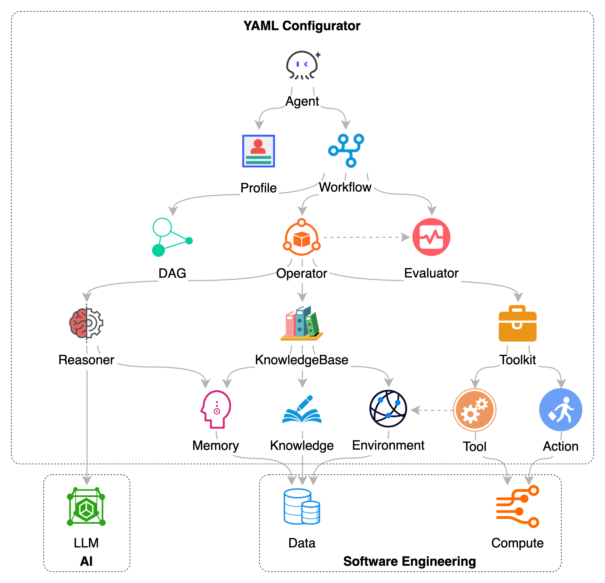

# SDK

Chat2Graph SDK 提供了一套分层 API，用于构建和扩展智能体（`Agent`）系统。该设计旨在分离组件职责，以支持模块化和可扩展性，帮助开发者构建智能体的特定能力。

## 1. SDK 的分层设计

如图所示， Chat2Graph SDK 是分层的，下层的模块支持上层的模块。最顶层是**智能体（`Agent`）**，它代表了系统的核心执行单元和与用户交互的接口。智能体的具体行为和目标由其**配置（`Profile`）** 所定义，其任务的执行流程则通过**工作流（`Workflow`）** 进行编排。

工作流的执行依赖于下一层的引擎。**算子（`Operator`）** 作为任务执行的调度者，负责管理和驱动工作流中定义的步骤。为处理任务序列和依赖关系，算子利用 **DAG 任务图（`JobGraph`）** 来组织和追踪子任务。在执行过程中，**评估器（`Evaluator`）** 对算子中间结果或状态进行评估，以确保任务按预期方向推进。

这些上层组件的运作，依赖于基础能力层的支持：

* **推理器（`Reasoner`）** 是智能体认知能力的一部分，它封装了与大语言模型（LLM）的交互逻辑，使智能体能够进行理解、思考、规划和生成内容。
* **知识库（`KnowledgeBase`）** 为智能体提供持久化记忆和知识管理功能。它整合了记忆（`Memory`）、结构化知识（`Knowledge`），并能感知和利用系统**环境（`Environment`）** 信息。
* **工具包（`Toolkit`）** 则为智能体提供与外部世界交互和执行具体操作的机制。它通过定义一系列**工具（`Tool`）** 和**动作（`Action`）**，使得智能体能够调用外部 API、访问环境（`Environment`）或执行特定的计算（`Compute`）任务。

通过这种层层支持的架构，Chat2Graph SDK 允许开发者组合和配置这些组件。高层组件定义任务目标和流程，而底层组件提供执行所需的能力。这种设计思路旨在将大语言模型的认知能力与软件工程中的数据处理、计算资源利用和流程控制等实践相结合，构建一个更加全面的智能体应用。

## 2. SDK API

### 2.1. Reasoner SDK

### 2.2. Toolkit SDK

...
