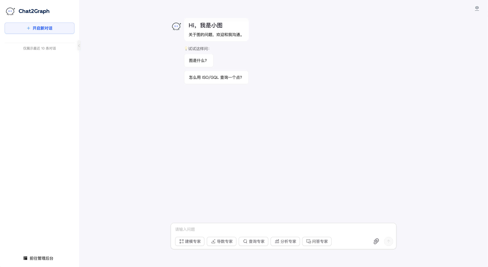

# 用户手册

欢迎使用 Chat2Graph！该应用程序允许您通过聊天界面与图专家互动，执行各种与图相关的任务，
包括建模、导数、查询、分析、问答等。本手册将指导您了解 Chat2Graph 的功能和用法。

# 目录

* [聊天](./chat/chat.md)

* [图数据库](./graph_db/graph-db.md)

* [知识库](./knowledge/knowledge-base.md)

<!-- 其他模块文档可用时在此处添加链接 -->
<!--
### Agent
### DAL
### Env
### Memory
### Model
### Reasoner
### SDK
### Service
### Toolkit
### Workflow
-->

<!-- 插件文档可用时在此处添加链接 -->
