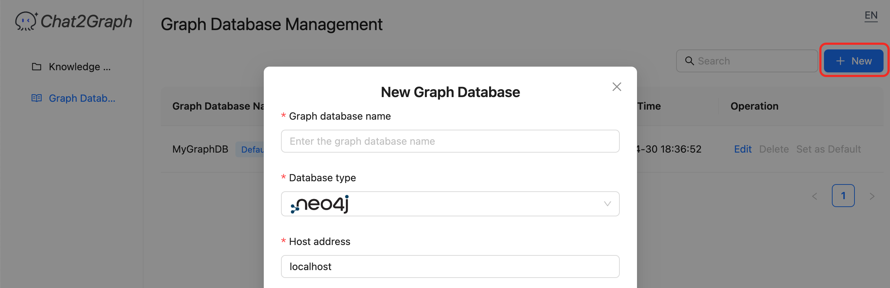

Chat2Graph can interact with multiple graph databases and supports the management of the connections to them.


+ **Navigation:** Accessed via the "Graph Database Management" link in the manager's sidebar.
+ **Search Bar:** Allows filtering the list of databases by name or other criteria.
+ **New Button:** Opens a form or dialog to add a new graph database connection. This typically requires providing a name, the database address (e.g., `localhost:7687` for Neo4j), credentials, and potentially selecting a default schema.
+ **Database List:** Displays configured graph databases in a table format with the following columns:
  + **Graph Database Name:** The user-defined name for the connection (e.g., `my_db`). A "Default" tag indicates the database used by default for operations if not otherwise specified.
  + **Graph Database Address:** The network address and port of the database instance.
  + **Default Graph Schema:** (May show the name of the default schema associated with this connection, if applicable).
  + **Update Time:** The timestamp when the connection configuration was last modified.
  + **Operation:** Actions available for each database connection:
    + **Edit:** Modify the connection details.
    + **Delete:** Remove the database connection.
    + **Set as Default:** Mark this database connection as the default one to use.
+ **Please note** that in the conversation, if you want Chat2Graph to operate smoothly with the graph database, please ensure that a default graph database has been created.

## 1. Graph Database Installation

Make sure to install and set up the graph database locally or remotely before Chat2Graph interacts with the default graph database.

The graph databases currently supported by Docker are:

+ Neo4j

```bash
docker pull neo4j:latest
docker run -d -p 7474:7474 -p 7687:7687 --name neo4j-server --env NEO4J_AUTH=none \
  --env NEO4J_PLUGINS='["apoc", "graph-data-science"]' neo4j:latest
```

+ TuGraph-DB

**Note**: we will support TuGraph-DB connectivity in the future.

```bash
docker pull tugraph/tugraph-runtime-centos7:4.5.1
docker run -d -p 7070:7070 -p 7687:7687 -p 9090:9090 --name tugraph-server \
  tugraph/tugraph-runtime-centos7:latest lgraph_server -d run --enable_plugin true
```

## 2. Graph Database Registration

After the installation and startup of the graph database is complete, click the "New" button to register the graph database for use.

