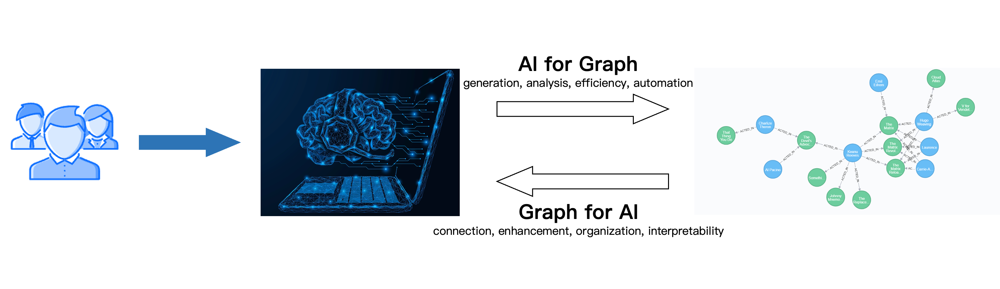

# Introduction

## 1. Background of "Graph + AI"

Traditional tabular data processing technologies, such as distributed databases, data warehouses, and data lakes, have been continuously evolving and gradually maturing. In comparison, graph-based data processing technologies (graph databases, graph computing engines) provide new ideas and methods, but also face issues such as low ecological maturity and high barriers to product usage. With the rise of large language models (LLMs), how to effectively combine artificial intelligence technology with graph computing technology (Graph + AI) will be a very worthwhile direction to explore. On one hand, we can leverage cutting-edge technologies like LLMs and agents to lower the barriers to using graph computing products and enhance the user experience with graphs. On the other hand, graph computing technology can fully utilize the performance and interpretability advantages of graph data structures in relational analysis scenarios, assisting LLMs and intelligent agents in improving reasoning capabilities and generation quality.

## 2. What is Chat2Graph ?

Chat2Graph is a Graph Native Agentic System. By leveraging the inherent advantages of graph data structures such as relationship modeling and interpretability, it enhances key capabilities of agents including reasoning, planning, memory, and tools. This enables diverse functionalities in intelligent R&D, O&M, Q&A, and generation within graph databases, helping users, developers, PD, SA, and SRE to efficiently utilize graph databases, lower the barriers to using graphs, accelerate content generation, and achieve chat with graphs. It truly realizes the deep integration of graph computing technology and artificial intelligence technology, known as "Graph + AI".

For detailed information on the design and implementation of Chat2Graph, please refer to "[Principle](principle/overview.md)".

## 3. Applications

Current applicable scenarios include:

- **Knowledge Graph Construction & Interactive Exploration**: Automatically builds domain-specific knowledge graphs from vast text, reports, or diverse data sources, allowing users to query, analyze, and visualize via natural language.
- **Deep Analysis of Complex Relationship Networks**: Reveals deep connections, key nodes, and community structures in fields like social network analysis, financial risk control (e.g., anti-fraud, related transaction identification), supply chain optimization, bioinformatics (e.g., protein interaction networks), and intelligence analysis.
- **Intelligent Q&A & Decision Support**: Provides context-aware advanced Q&A services based on dynamically built and updated knowledge graphs, delivering data-driven insights for complex decision-making.
- **High-Quality Reasoning & Content Generation**: Deeply integrates symbolic strengths for high-quality task planning and memory recall, enabling precise tool invocation. We will continue to improve this capability.

Refer to the "[Quickstart](quickstart.md)" to start experiencing Chat2Graph. At the same time, the "[Cookbook](cookbook/overview.md)" provides a detailed introduction to the product features and operation methods of Chat2Graph.