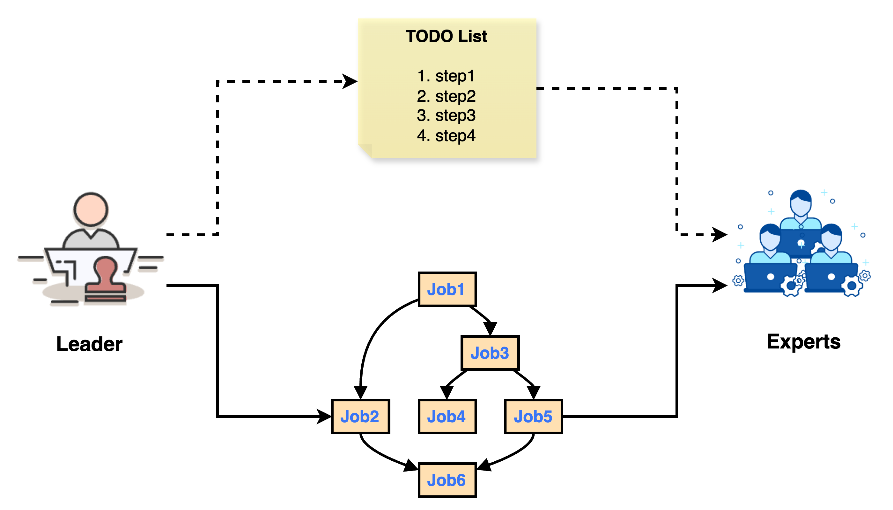
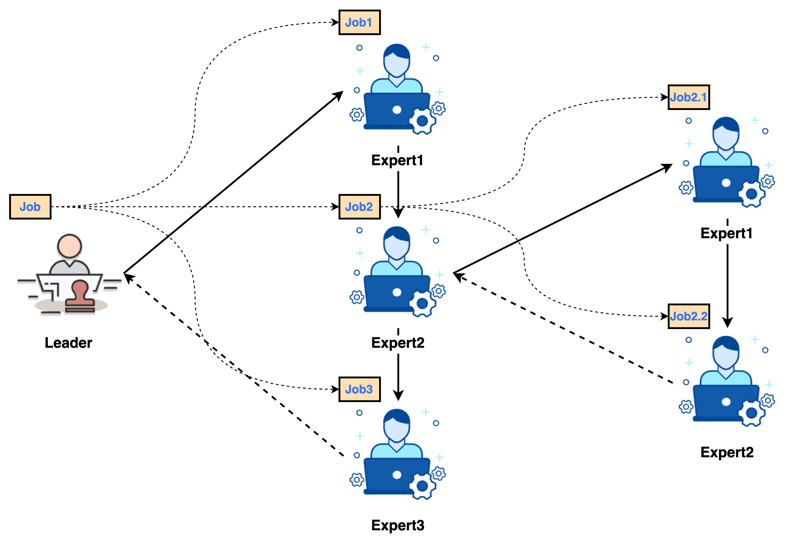

# Leader

## 1. Introduction

As the core component and main entry point of the Chat2Graph system, the Leader is responsible for job planning, assignment, execution, and Expert lifecycle management.

## 2. Design

The Leader is initialized via `AgentConfig` and manages Expert lifecycles through `LeaderState`. After receiving a job, the Leader processes it through three phases: job planning, job assignment, and job execution.

## 2.1. Planning

The agent planner primarily handles job planning and decomposition. Unlike traditional linear planners in agent systems, Chat2Graph employs a graph-based planner that breaks down agent jobs into executable units while preserving dependencies between subjobs, better accommodating execution uncertainties.

The planner's core lies in a carefully designed prompt, `JOB_DECOMPOSITION_PROMPT`, which guides the `Leader` to decompose a main job (`Given Task`) into executable subjobs. The `Leader` first combines conversation history with the current system state to infer the user's true intent and expected next logical step. Based on this inference, the `Leader` determines the target expert (`Expert`) and actions required to complete this step. Task decomposition is its sole output—even with incomplete information (e.g., if the user forgot to upload a file), it must create subjobs for relevant experts and note potential issues in the subjob context. During decomposition, the LLM should aim for the minimal necessary logical subjobs while ensuring assignments are limited to predefined experts. Each subjob must contain all essential information, remain role-neutral, and strictly adhere to the original job scope. For simple jobs or those requiring only one expert, a single subjob should be generated.

Upon receiving an `OriginalJob`, if no preset `Expert` exists, the `Leader` decomposes it into a subjob graph (`JobGraph`). This graph is a Directed Acyclic Graph (DAG) where nodes represent subjobs (`SubJob`) and edges represent dependencies between them.

> If the `OriginalJob` has a preset `Expert`, the `Leader` skips decomposition and directly assigns the job to that `Expert`, resulting in a single-node `JobGraph` (the original job itself).

Chat2Graph explicitly defines subjob fields (see `JOB_DECOMPOSITION_OUTPUT_SCHEMA`) and uses `JobGraph` to express dependencies between subjobs.

| Field                  | Description                                                                                                                                        |
| :-------------------- |:---------------------------------------------------------------------------------------------------------------------------------------------------|
| `goal`                | The goal, which must precisely reflect the user's latest request.                                                                                  |
| `context`             | Context, including a summary of conversation history, user feedback, and how this context shapes the current job.                                  |
| `completion_criteria` | Completion criteria, which must be clear, measurable, and directly address needs or corrections highlighted in the conversation history.           |
| `dependencies`        | Dependencies, defined only when generating multiple subjobs to establish relationships between them, forming a `JobGraph` managed by `JobService`. |
| `assigned_expert`     | The assigned expert's name, indicating which expert will handle this subjob.                                                                       |
| `thinking`            | Reasoning process, requiring the LLM to explain in first-person why this subjob is necessary, its preliminary approach, and key considerations.    |

## 2.2. Assignment

During job assignment, the `Leader` assigns subjobs organized in the `JobGraph` to corresponding experts for execution.

1. **Parallel Task Scheduling**: The `Leader` uses a thread pool to parallelize subjobs without dependencies or whose dependencies are already met. It continuously monitors job status, submitting subjobs for execution once all their predecessors complete.
2. **Expert Assignment**: Each `SubJob` is dispatched to its designated `Expert`. The `Expert` executes its internal `Workflow` to process the subjob.

## 2.3. Execution

We use a state machine to explain the transfer and transition mechanism between `Job/SubJob` and `Agent`.
 

After an `Expert` completes a `SubJob`, it returns a `WorkflowMessage` containing `workflow_status`, which determines subsequent actions:
  - `SUCCESS`: The subjob completes successfully. The `Leader` records the result, updates the `JobGraph` state, and may trigger execution of dependent jobs.
  - `EXECUTION_ERROR`: An internal error occurs during `Expert` execution (e.g., API request failure). The `Leader` decides whether to retry based on `retry_count`. If retries are exhausted, the subjob and entire `JobGraph` may be marked as `FAILED`.
  - `INPUT_DATA_ERROR`: The `Expert` identifies invalid input data and cannot proceed. The `Leader` requeues this subjob and its dependencies, potentially attaching a `lesson` (feedback) for predecessor jobs to correct their output.
  - `JOB_TOO_COMPLICATED_ERROR`: The `Expert` deems the subjob too complex to handle alone. The `Leader` treats this subjob as a new `OriginalJob`, decomposing it further into smaller subjobs and updating the `JobGraph`. To prevent infinite decomposition, subjobs have a `life_cycle` counter that decrements with each decomposition until zero.

When all subjobs in the `JobGraph` complete successfully, the original job is marked as done. If any critical subjob fails or execution is interrupted (e.g., via `fail_job_graph` or `stop_job_graph`), the original job is marked as `FAILED` or `STOPPED`, respectively.

This state machine enables parallel processing based on dependencies while providing adaptability and error recovery. Additionally, `JobGraph` supports interruption (`stop_job_graph`) and resumption (`recover_original_job`), making multi-agent collaboration under the `planner` more flexible and controllable.

## 3. API

The `Leader` Agent provides the following core APIs.

| Method Signature                                     | Description                                                                                                                                                                                                                                                                                                                                                             |
| :--------------------------------------------------------------- |:------------------------------------------------------------------------------------------------------------------------------------------------------------------------------------------------------------------------------------------------------------------------------------------------------------------------------------------------------------------------|
| `execute(self, agent_message: AgentMessage, retry_count: int = 0) -> JobGraph` | Core job decomposition method. Accepts an `AgentMessage` containing a job (either an original job or a subjob needing further decomposition). If the job has a preset expert, it creates a single-node `JobGraph`; otherwise, it uses internal `Workflow` and `Reasoner` to decompose the job into a `JobGraph`. Includes validation and retry logic based on `lesson`. |
| `execute_original_job(self, original_job: Job) -> None`          | Accepts an `OriginalJob`. Updates its status to `RUNNING`, decomposes it into a `JobGraph` via `execute`, stores the graph in `JobService`, and executes it via `execute_job_graph`.                                                                                                                                                                                    |
| `execute_job_graph(self, original_job_id: str) -> None`          | Executes the `JobGraph` associated with `original_job_id`. Uses `ThreadPoolExecutor` to parallelize subjobs without pending dependencies. Handles post-execution `WorkflowStatus` (e.g., `SUCCESS`, `INPUT_DATA_ERROR`) to update the graph or reschedule jobs.                                                                                                         |
| `stop_job_graph(self, job_id: str, error_info: str) -> None`     | Stops the entire `JobGraph` related to `job_id` (original or subjob ID). Marks the original job and all unfinished subjobs as `STOPPED`, logging the error. Running jobs are not forcibly interrupted but will update their status upon completion.                                                                                                                     |
| `fail_job_graph(self, job_id: str, error_info: str) -> None`     | Marks the specified `job_id` as `FAILED` (if no final result exists), then invokes `stop_job_graph` to halt the entire graph and mark other jobs as `STOPPED`.                                                                                                                                                                                                          |
| `recover_original_job(self, original_job_id: str) -> None`       | Resumes a previously `STOPPED` original job. If undecomposed (no subjobs), resets status to `CREATED` and re-invokes `execute_original_job`. If decomposed, sets the original job to `RUNNING`, resets `STOPPED` subjobs to `CREATED`, and re-invokes `execute_job_graph`.                                                                                              |
| `state(self) -> LeaderState` (property)                          | Retrieves the `Leader`'s state object (`LeaderState`), which manages runtime information like available `Expert` lists.                                                                                                                                                                                                                                                 |

## 4. Example

Below demonstrates a typical graph data job processing scenario:

Here are some code examples:

* Leader executes string processing tasks: `test/example/agent/run_leader_v1.py`
* Leader executes natural language processing tasks: `test/example/agent/run_leader_v2.py`