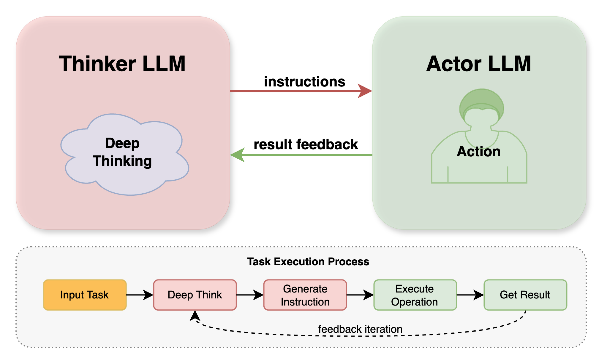

## 1. Introduction

The Reasoner module is the core component in Chat2Graph responsible for interacting with Large Language Models (LLMs). Its primary responsibilities include processing prompts, executing reasoning tasks, and providing the Agent with robust tool-calling capabilities. By offering a unified LLM interaction interface, the Reasoner encapsulates the underlying LLM Client API, enabling developers to concentrate on higher-level development. It supports (semi-)structured output, tool calling, and dual (or mono) model reasoning. Consequently, it provides two core reasoner implementations: `MonoModelReasoner` and `DualModelReasoner`, to adapt to the needs of different scenarios.

## 2. Design

### 2.1. Model Service

The Model Service (`ModelService`) in Chat2Graph acts as the underlying interface and implementation layer for interacting with Large Language Models (LLMs). It encapsulates the calling details for different LLM platforms (e.g., DB-GPT, AiSuite) and supports all OpenAI API-compatible models (e.g., Gemini, Qwen, DeepSeek, with configuration examples available in the `.env.template` file).

In terms of tool calling, the Model Service relies on specific tag formats (e.g., `<function_call>...</function_call>`) to extract tool call requests from the LLM's output. Furthermore, it supports the automatic injection of inner system services (e.g., `GraphDbService`), defined via `app.core.reasoner.injection_mapping`, as parameters into target tools during tool calls, thereby enhancing the flexibility and functionality of the tools. The standard format for tool calls is detailed in: `FUNC_CALLING_PROMPT`.

The Reasoner utilizes the generic `ModelService` to invoke LLMs.

To clearly present the workflow of `Reasoner` and its interaction with `ModelServices`, tools, and environments, we designed the "Reasoner Enhancement" architecture, as shown in the figure below:

| Method Signature                                                                 | Description                                                                                                                                                                                                                           |
| :------------------------------------------------------------------------------------------ | :---------------------------------------------------------------------------------------------------------------------------------------------------------------------------------------------------------------------------------------------- |
| `async generate(self, sys_prompt: str, messages: List[ModelMessage], tools: Optional[List[Tool]] = None) -> ModelMessage` | This is the core interface for interacting with the LLM. Subclasses must implement this method to define how to send the system prompt (`sys_prompt`), history messages (`messages`), and an optional list of available tools (`tools`) to the underlying LLM, and asynchronously return the model's response (`ModelMessage`).                                                              |
| `async call_function(self, tools: List[Tool], model_response_text: str) -> Optional[List[FunctionCallResult]]`     | This asynchronous method is responsible for processing tool call requests that may be contained in the model's response. It parses `<function_call>` tags in `model_response_text`, finds the corresponding tool functions, injects necessary service dependencies, executes the functions, and returns a list of `FunctionCallResult` containing all call results (successful or failed). If there are no valid tool call requests in the model response, it returns `None`. |

### 2.2. Mono-Model Reasoner

The `MonoModelReasoner` operates by relying on a single LLM instance to complete all task processing stages, including understanding user instructions, performing thinking, selecting necessary tools, and finally generating a reply or executing an action. Its main advantages are simple and intuitive configuration, and a relatively simple and short reasoning chain since all processing steps are handled by the same model.

However, this mono-model architecture often exhibits performance limitations when handling tasks that require strong reasoning capabilities or complex combinations of abilities (such as strong general understanding combined with complex tool usage). To achieve a performance level comparable to `DualModelReasoner`, `MonoModelReasoner` typically needs to rely on a single model with a larger number of parameters, which introduces a trade-off between cost and performance.

Therefore, `MonoModelReasoner` is more suitable for scenarios where task complexity is relatively singular, or where the chosen LLM itself performs excellently in all aspects and is cost-effective. Its overall performance is entirely dependent on the capabilities of the selected single LLM.

#### 2.2.1. Mono-Model Reasoner Prompt

The `MonoModelReasoner` uses a unified Prompt template (`MONO_PROMPT_TEMPLATE`) to guide the LLM's behavior. This template is designed to enable a single LLM to handle complex tasks in a "self-sufficient" manner, forming a complete processing loop from understanding, planning, and execution, to repeating previous steps and finally delivering the result.

The Prompt for the Mono-Model Reasoner is parsed as follows:

* **Metacognitive Framework**: Inspired by the state transitions in quantum mechanics. Similar to the Thinker in `DualModelReasoner`, the `MonoModelReasoner` is required to use the Metacognitive Framework for deep thinking (`<deep_thinking>`). This includes utilizing thinking states (`<Basic State>`, `<Superposition State>`, `<Transition State>`, and `<Field State>`) and thinking mode markers to organize and present its reasoning process and depth.

* **Integrated Thinking and Action (`<deep_thinking>` & `<action>`) in One Model**:
  * `<deep_thinking>`: This section is used to record the LLM's cognitive process, requiring it to demonstrate specific, decisive, comprehensive, and direct thinking.
  * `<action>`: After deep thinking, the `Reasoner` executes specific actions in this section, which may include text generation, analysis, or calling external tools (functions). The Prompt also explicitly defines the format for tool calls (`<function_call>...</function_call>`). After a tool call, the system provides the call's result, and the `Reasoner` can make judgments and subsequent thoughts/corrections based on these results (including failed calls). If a call fails, the `Reasoner` should attempt to correct and recall.

* **Stop Conditions and Deliverables**:
  * When the LLM independently determines that the task has been resolved, it must use the `TASK_DONE` and `<deliverable>` tags to mark task completion and generate the final deliverable.

#### 2.2.2. Mono-Model Reasoner API

| Method Signature                             | Description                                                                                                                                |
| :------------------------------------------------------ | :----------------------------------------------------------------------------------------------------------------------------------------------- |
| `async infer(self, task: Task) -> str`                  | Asynchronously executes the core reasoning process of the mono-model reasoner. Receives a `Task` object, iteratively calls the model to generate responses, processes tool calls, until stopping conditions are met, and finally extracts the result via `conclude`.                 |
| `async conclude(self, reasoner_memory: ReasonerMemory) -> str` | Asynchronous method used to extract and format the final reasoning result from the payload of the last message in `ReasonerMemory`. Typically called internally by the `infer` method.                               |
| `static stopped(message: ModelMessage) -> bool`         | Static method to determine if the reasoning process should stop. Checks if the payload of `ModelMessage` contains both `<deliverable>` and `</deliverable>` tags. Typically called internally by the `infer` method. |

### 2.3. Dual-Model Reasoner

The `DualModelReasoner` (Dual-Model Reasoner) typically employs a "Thinker" LLM and an "Actor" LLM working in collaboration, similar to two LLMs engaging in a turn-by-turn, interactive dialogue. The main model (Thinker), usually a more capable LLM with superior understanding and planning abilities, is responsible for understanding complex user intents, decomposing tasks, creating plans, and deciding which tool or sub-task to call when needed. Subsequently, the Thinker passes specific, clearly defined, step-by-step tasks or tool call requests to the auxiliary model (Actor) for execution. The Actor is an LLM that is more efficient in specific aspects, such as following instructions for formatted output, executing specific types of tool calls, or quickly generating thought-out answers.

The core advantage of this dual-model design lies in task specialization and enhanced tool usage capabilities. It allows for configuring specially optimized role Prompts for specific sub-tasks (like code generation or natural language dialogue), thereby improving overall effectiveness. The Actor can focus on handling tool call requests and response formatting, allowing the Thinker to concentrate more on core reasoning and planning. Compared to `MonoModelReasoner`, the potential of `DualModelReasoner` lies in intelligently assigning tasks to models with different roles, aiming for superior overall performance. For example, the Thinker handles complex logic, while the Actor quickly processes tool calls with fixed formats.

#### 2.3.1. Dual-Model Reasoner Prompt

The effectiveness of the `DualModelReasoner` benefits from its "special" prompt configuration. Its core lies in configuring different Prompt templates for the "Thinker" and "Actor" LLMs, guiding them to undertake distinct responsibilities: allowing the Thinker to focus on complex planning and reasoning, while the Actor concentrates on efficiently and accurately executing tasks and interacting with external tools.

* **Thinker Prompt**:
  * **Role Definition**: Clearly instructs the LLM to act as the "Thinker", responsible for deep thinking, planning, and generating instructions.
  * **Metacognitive Framework**: The Thinker is required to use the Metacognitive Framework for deep thinking (`<deep_thinking>`) and to present its complex reasoning process through cognitive states and thinking mode markers.
  * **Instruction Generation**: The Thinker's main output is to generate clear, specific instructions (`<instruction>`) and necessary inputs (`<input>`) for the Actor.
  * **Tool Call Result Evaluation**: The Thinker is responsible for evaluating the Actor's results. If the Actor called a tool, the Thinker also evaluates the result returned after the tool call execution (`<function_call_result>`). Based on this, the Thinker will plan the next steps and adjust instructions.
  * **Dialogue Management**: Includes rules such as dialogue turn limits and task termination conditions (`TASK_DONE`) to ensure efficient task progression.
  * **Prohibited Actions**: The Thinker should not execute tool calls itself or generate the final deliverable.

* **Actor Prompt**:
  * **Role Definition**: Clearly instructs the LLM to act as the "Actor", responsible for receiving and executing the Thinker's instructions.
  * **Instruction and Input Processing**: The Actor's core task is to understand the `<instruction>` and `<input>` provided by the Thinker and act accordingly.
  * **Shallow Thinking (`<shallow_thinking>`)**: The Actor performs relatively "shallow" thinking, primarily focusing on how to accurately execute the current instruction and explaining its action plan.
  * **Action Execution (`<action>`)**: The Actor executes specific operations in the `<action>` part, which may include generating text, performing analysis, or calling tools (functions). Tool calls must strictly adhere to the `<function_call>...</function_call>` format.
  * **Stop Conditions and Deliverables**: When the Thinker issues a `TASK_DONE` instruction, the Actor is responsible for integrating information and generating the final deliverable (`<deliverable>`), which includes the task objective, context, key reasoning points, and the final output.

#### 2.3.2. Dual-Model Reasoner API

| Method Signature                             | Description                                                                                                                                                             |
| :------------------------------------------------------ | :------------------------------------------------------------------------------------------------------------------------------------------------------------------------------ |
| `async infer(self, task: Task) -> str`                  | Asynchronously executes the core reasoning process of the dual-model reasoner, coordinating the interaction between Thinker and Actor LLMs. Receives a `Task` object, alternately calls the Thinker and Actor models, processes tool calls from the Actor, until stopping conditions are met, and finally extracts the result via `conclude`. |
| `async conclude(self, reasoner_memory: ReasonerMemory) -> str` | Functionality and logic are basically consistent with the `conclude` method in `MonoModelReasoner`. Asynchronous method used to extract and format the final reasoning result from the payload of the last message in `ReasonerMemory`. Typically called internally by the `infer` method.                               |
| `static stopped(message: ModelMessage) -> bool`         | Functionality and logic are completely consistent with the `stopped` method in `MonoModelReasoner`. Static method to determine if the reasoning process should stop, by checking if the Actor's latest response contains the `<deliverable>` tag. Typically called internally by the `infer` method.                 |

## 3. Examples

* Model Service Invocation (`ModelService`)

  * Basic Response (without tools): `test/example/run_model_service.py`
  * Tool Calling (with tools): `test/example/run_function_calling.py`

* Mono-Model Reasoner Invocation (`MonoModelReasoner`)

  * General Reasoning (without tools): `test/example/run_reasoner_without_func_calling.py` (configured as `MonoModelReasoner`)
  * Tool Calling (with tools): `test/example/run_mono_reasoner_with_func_calling.py`

* Dual-Model Reasoner Invocation (`DualModelReasoner`)

  * General Reasoning (without tools): `test/example/run_reasoner_without_func_calling.py` (configured as `DualModelReasoner`)
  * Tool Calling (with tools): `test/example/run_dual_reasoner_with_func_calling.py`
