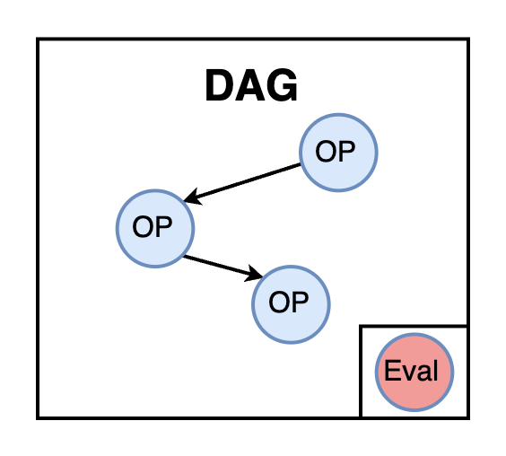

# Workflow

## 1. Introduction

The Workflow module is the core component for task execution by `Agent` (`Leader` and `Expert`) in Chat2Graph. It orchestrates and executes a series of predefined operators. By organizing multiple operators into a Directed Acyclic Graph (DAG), the `Workflow` clarifies the execution order and dependencies among these operators.

<div style="text-align: center;">
  
</div>

Each `Agent` must have a built-in `Workflow`, which defines the standard operating procedure (SOP) that the `Agent` should follow to complete specific types of tasks. Additionally, the `Workflow` module supports the integration of an optional evaluation operator (`Evaluator`). The evaluator is triggered after the workflow execution completes and is responsible for evaluating the results, potentially generating feedback (`lesson`) for subsequent operators or experts to reference and use.

The `Operator`, as the basic execution unit of `Workflow`, encapsulates a specific `Job` along with the tools, actions, and relevant contextual information (e.g., outputs from upstream operators and experts, knowledge base information, environment state, etc.) into an executable `Task` object. The `Operator` then submits this `Task` to the `Reasoner` module for processing and ultimately returns the execution result.

The core functionality of the `Operator` lies in task preparation and distribution, rather than directly executing complex logical operations or interacting with external tools. It relies on the `Reasoner` to perform reasoning and tool calls, thereby decoupling task definition from task execution. The `Evaluator`, as a special type of operator, is responsible for analyzing the quality and judging the state of the workflow's execution results. By identifying potential issues through predefined error patterns, it provides critical support for the reliability and self-correction capabilities of the entire workflow, and even multi-agent systems.

## 2. Operator

### 2.1. Definition

The behavior and capabilities of an `Operator` are configured through the `OperatorConfig` object. These configurations collectively determine the specific behavior of an `Operator` instance, enabling it to perform specialized operations for specific task phases.

`OperatorConfig` includes the following fields:

| Field             | Description                                                                                                                                                                                             |
| :--------------- | :----------------------------------------------------------------------------------------------------------------------------------------------------------------------------------------------- |
| `instruction`    | Instructions for the `Reasoner`. Describes the `Operator`'s role, task objectives, execution considerations, and expected output style. The `Reasoner` uses these instructions to understand the task and plan execution steps. Cannot be empty.                                                                 |
| `actions`        | A list of `Action` objects defining the series of actions the `Operator` can invoke during task execution. Based on these `Action`s, the `Operator` obtains recommended tools (`Tool`) and more specific actions through the `ToolkitService` for the `Reasoner` to select and execute.                                                               |
| `output_schema`  | Defines the expected format and structure of the output after the `Operator` completes execution. This is typically a YAML, JSON, or natural language string description guiding the `Reasoner` to generate structured output that meets expectations.                                                                                             |
| `threshold`      | The similarity or relevance threshold used when obtaining recommended tools and actions through the `ToolkitService` (only tools or actions with a relevance score above this threshold will be recommended).                                                                                                     |
| `hops`           | The number of "hops" or depth explored in the `Toolkit`'s graph structure when recommending tools and actions. Represents the maximum number of relationship layers allowed when searching for related `Action`s or `Tool`s from the current `Action` in the graph.                                                                                             |

### 2.2. Execution

When an `Operator` is invoked for execution, its workflow is as follows:

1. **Build Task**:
    * Receives a `Job` object containing the task's objectives and context.
    * Integrates tools (`Tool`) and actions (`Action`).
    * Combines output information (`WorkflowMessage`) from previous operators or other experts.
    * Retrieves knowledge from the knowledge base and obtains environmental insights (under construction).
    * Assembles all this information, along with lessons learned and file descriptors, into a `Task` object.
    
2. **Execute Task**:
    * Passes the constructed `Task` object to the `Reasoner` for reasoning.
    * Returns a `WorkflowMessage` for use in subsequent steps of the workflow.

### 2.3. Evaluator

The `Evaluator` is a special operator in the workflow used to assess the quality and classify the state of the workflow's execution results.

Workflow execution results are divided into four states. Priority indicates the judgment order when multiple error patterns coexist, with higher-priority states taking precedence.

| State                          | Priority | Description                                                   | Typical Scenarios                                         |
| :---------------------------- | :----: | :----------------------------------------------------- | :----------------------------------------------- |
| `EXECUTION_ERROR`             | **Highest** | Execution process or reasoning logic has flaws, unrelated to input quality.             | Logical contradictions, instruction violations, tool call failures.                 |
| `INPUT_DATA_ERROR`            |   High   | Input data issues prevent task completion, while execution itself is correct.             | Missing data, format errors, structural anomalies.                     |
| `JOB_TOO_COMPLICATED_ERROR`   |   Medium   | The task is too complex and exceeds current capabilities.                         | Tasks beyond the operator's capability range.           |
| `SUCCESS`                     | **Lowest** | The task is successfully completed, with results reasonably meeting objectives.                     | Normal completion, correct output, clear logic.                     |

The structure of the `WorkflowMessage` returned by the `Evaluator` is as follows:

```json
{
  "scratchpad": "Output content of the evaluated operator",
  "status": "SUCCESS | EXECUTION_ERROR | INPUT_DATA_ERROR | JOB_TOO_COMPLICATED_ERROR",
  "evaluation": "Detailed evaluation notes",
  "lesson": "Lessons learned and improvement suggestions"
}
```

## 3. Workflow

A workflow is a directed acyclic graph (DAG) structure composed of multiple operators organized according to specific dependencies. In this graph, each node represents an operator, and edges indicate data flow and execution order between operators. The workflow design enables data to flow from one operator to the next, forming a complete task processing pipeline. In addition to the main execution operators, a workflow can optionally integrate an evaluator operator at the end to assess the quality and status of the workflow's output.


### 3.1. Construction

When the `execute` method of `Workflow` is first called, it triggers a workflow construction method (protected by a thread lock to ensure single construction). This method converts `_operator_graph` and `_evaluator` into a concrete executable workflow instance, such as `DbgptWorkflow`, which is implemented by default using DB-GPT AWEL (Agentic Workflow Expression Language).


### 3.2. Execution

After construction, the `Agent` invokes `Workflow`, passing in the current task (`Job`), `Reasoner`, outputs from previous `Expert` (`workflow_messages`), and potential lessons learned (`lesson`).


| Parameter            | Description                                                                                                                                                                                                                                                           |
| :------------------- | :------------------------------------------------------------------------------------------------------------------------------------------------------------------------------------------------------------------------------------------------------------------- |
| `job`                | The current task object to be executed. It contains the task's goal, context information, session ID, etc. For workflows within `Leader`, this is typically an original task or a sub-task requiring further decomposition. For workflows within `Expert`, this is usually a specific sub-task. |
| `workflow_messages`  | An optional list of `WorkflowMessage` objects. These messages typically contain outputs from preceding `Operator`(s) **within the same `Agent`**, which can serve as context or input data for the current `Operator`. For the first `Operator` in the workflow, this parameter is usually `None`. |
| `lesson`             | An optional string representing lessons learned from prior executions or other agents (typically feedback from subsequent agents evaluating the current agent's output, or lessons generated during retries). These lessons can guide the current `Workflow` to better accomplish tasks or avoid previous errors. For example, if an `Expert` returns `INPUT_DATA_ERROR`, it may attach a `lesson` for the preceding `Expert` pointing out input data issues. |


### 3.3. Return

Upon completion, a `WorkflowMessage` object is returned. This object contains the workflow's execution status (`WorkflowStatus`), evaluation results (if an `Evaluator` is configured), and potential `lesson`s. If no `Evaluator` is configured, a successfully executed `Workflow` defaults to setting the status to `SUCCESS`.

## 4. API Design

### 4.1. Operator API

| Method Signature                                                                                                                                 | Description                                                                                                                                                                                                                     |
| :---------------------------------------------------------------------------------------------------------------------------------------------- | :--------------------------------------------------------------------------------------------------------------------------------------------------------------------------------------------------------------------------- |
| `execute(self, reasoner: Reasoner, job: Job, workflow_messages: Optional[List[WorkflowMessage]] = None, previous_expert_outputs: Optional[List[WorkflowMessage]] = None, lesson: Optional[str] = None) -> WorkflowMessage` | Executes the operation. First calls the `_build_task` method to construct a `Task` object, then hands the task to the provided `Reasoner` for reasoning and execution. Finally, encapsulates the `Reasoner`'s result into a `WorkflowMessage` and returns it. |
| `get_knowledge(self, job: Job) -> Knowledge`                                                                                                    | Retrieves knowledge related to the current `Job` from the knowledge base. It constructs queries based on the `Job`'s goal and context and performs retrieval via `KnowledgeBaseService`.                                      |
| `get_env_insights(self) -> Optional[List[Insight]]`                                                                                             | Obtains environmental insights. Currently, this method returns `None` and is a feature to be implemented.                                                                                                                    |
| `get_id(self) -> str`                                                                                                                           | Retrieves the unique identifier of the `Operator`, which is derived from its configuration object `OperatorConfig`.                                                                                                           |

### 4.2. Workflow API

| Method Signature                                                                                                                               | Description                                                                                                                                                                                                                     |
| :--------------------------------------------------------------------------------------------------------------------------------------------- | :--------------------------------------------------------------------------------------------------------------------------------------------------------------------------------------------------------------------------- |
| `execute(self, job: Job, reasoner: Reasoner, workflow_messages: Optional[List[WorkflowMessage]] = None, lesson: Optional[str] = None) -> WorkflowMessage` | Executes the workflow. Accepts a task, reasoner, outputs from prior experts, and lessons learned, then returns the workflow execution result.                                                                                  |
| `add_operator(self, operator: Operator, previous_ops: Optional[List[Operator]] = None, next_ops: Optional[List[Operator]] = None)`             | Adds an operator to the workflow and optionally specifies its predecessor and successor operators to construct the operator graph.                                                                                             |
| `remove_operator(self, operator: Operator) -> None`                                                                                            | Removes the specified operator from the workflow.                                                                                                                                                                            |
| `set_evaluator(self, evaluator: Evaluator)`                                                                                                   | Configures an evaluator operator (`Evaluator`) for the workflow. This operator runs after the main operators complete execution to evaluate the results.                                                                       |
| `get_operator(self, operator_id: str) -> Optional[Operator]`                                                                                   | Retrieves an operator instance from the workflow by its ID.                                                                                                                                                                  |
| `get_operators(self) -> List[Operator]`                                                                                                        | Retrieves a list of all operator instances in the workflow.                                                                                                                                                                  |
| `update_operator(self, operator: Operator) -> None`                                                                                            | Updates an existing operator in the workflow. The operator ID must match.                                                                                                                                                    |

## 5. Usage Examples

This section provides examples of how to directly construct and execute `Operator`, `Evaluator`, and `DbgptWorkflow` through code.

* Operator Usage Example:
  * Initializing and executing a basic `Operator`, including configuring instructions, actions, and interacting with `Reasoner` and `ToolkitService`.
  * For details, see: `test/example/run_operator.py`

* Evaluator Usage Example:
  * Configuring and using an `Evaluator` to assess prior operation outputs and generate feedback.
  * For details, see: `test/example/run_eval_operator.py`

* Workflow (DbgptWorkflow) Usage Example:
  * Enables direct construction and execution of a `DbgptWorkflow` through code, including adding `Operator`s, configuring `Evaluator`, and executing the workflow.
  * For details, see: `test/example/run_workflow.py`