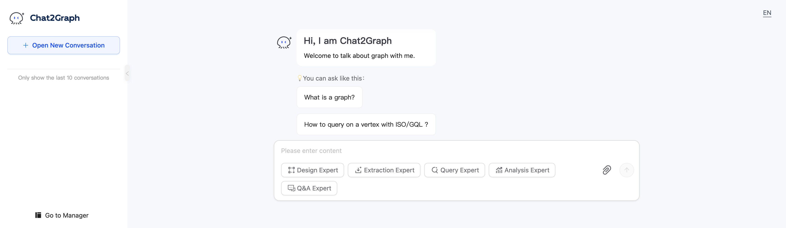
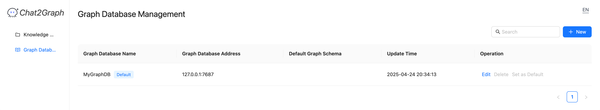

## 1. Preparation

Prepare the required versions of Python and NodeJS.

* Install Python: [Python == 3.10](https://www.python.org/downloads) recommended.
* Install NodeJS: [NodeJS >= v16](https://nodejs.org/en/download) recommended.

You can also use tools like [conda](https://docs.conda.io/projects/conda/en/latest/user-guide/install/index.html) to install the python environment.

```bash
conda create -n chat2graph_env python=3.10
conda activate chat2graph_env
```

## 2. Build & Start

### 2.1. Clone Code

```bash
git clone https://github.com/TuGraph-family/chat2graph.git
```

### 2.2. Build Chat2Graph

```bash
cd chat2graph
./bin/build.sh
```

### 2.3. System Configuration

Prepare `.env` file based on [.env.template](https://github.com/TuGraph-family/chat2graph/blob/master/.env.template). 

```bash
cp .env.template .env
```

Configure environment variables (e.g., LLM parameters), model `DeepSeek-V3` is recommended。

```bash
LLM_NAME=openai/deepseek-ai/DeepSeek-V3
LLM_ENDPOINT=https://api.siliconflow.cn/v1
LLM_APIKEY={your-llm-api-key}

EMBEDDING_MODEL_NAME=Qwen/Qwen3-Embedding-4B
EMBEDDING_MODEL_ENDPOINT=https://api.siliconflow.cn/v1/embeddings
EMBEDDING_MODEL_APIKEY={your-llm-api-key}
```

### 2.4. Start Chat2Graph

```bash
./bin/start.sh
```

The following log indicates that the Chat2Graph server has been started.

```text
Starting server...
Web resources location: /Users/florian/code/chat2graph/app/server/web
System database url: sqlite:////Users/florian/.chat2graph/system/chat2graph.db
Loading AgenticService from app/core/sdk/chat2graph.yml with encoding utf-8
Init application: Chat2Graph
Init the Leader agent
Init the Expert agents
  ____ _           _   ____   ____                 _     
 / ___| |__   __ _| |_|___ \ / ___|_ __ __ _ _ __ | |__  
| |   | '_ \ / _` | __| __) | |  _| '__/ _` | '_ \| '_ \ 
| |___| | | | (_| | |_ / __/| |_| | | | (_| | |_) | | | |
 \____|_| |_|\__,_|\__|_____|\____|_|  \__,_| .__/|_| |_|
                                            |_|          

 * Serving Flask app 'bootstrap'
 * Debug mode: off
WARNING: This is a development server. Do not use it in a production deployment. Use a production WSGI server instead.
 * Running on all addresses (0.0.0.0)
 * Running on http://127.0.0.1:5010
 * Running on http://192.168.1.1:5010
Chat2Graph server started success ! (pid: 16483)
```

### 3. Use Chat2Graph

You can access Chat2Graph in the browser at [http://localhost:5010/](http://localhost:5010/). For detailed usage, refer to the「[Cookbook](cookbook/overview.md)」。



#### 3.1. Register Graph Database

Register a graph database instance in advance to experience the full "Chat to Graph" functionality of Chat2Graph. Currently supported databases include [Neo4j](https://neo4j.com/) and [TuGraph](https://tugraph.tech/).



For details, refer to the [Graph Database](cookbook/graphdb.md) documentation.

#### 3.2. Chat to Graph

Automatically complete knowledge graph construction and analysis tasks.


Supports real-time rendering of graph models and data.


### 4. Integrate Chat2Graph

Chat2Graph provides a clean and simple SDK API, allowing you to easily customize the agent system. For details, refer to the「[SDK Reference](development/sdk-reference.md)」。

#### 4.1. Configure LLM Parameters

```python
SystemEnv.LLM_NAME="openai/deepseek-ai/DeepSeek-V3"
SystemEnv.LLM_ENDPOINT="https://api.siliconflow.cn/v1"
SystemEnv.LLM_APIKEY="{your-llm-api-key}"

SystemEnv.EMBEDDING_MODEL_NAME="Qwen/Qwen3-Embedding-4B"
SystemEnv.EMBEDDING_MODEL_ENDPOINT="https://api.siliconflow.cn/v1/embeddings"
SystemEnv.EMBEDDING_MODEL_APIKEY="{your-llm-api-key}"
```

#### 4.2. Initialize AgenticService

Customize [chat2graph.yml](https://github.com/TuGraph-family/chat2graph/blob/master/app/core/sdk/chat2graph.yml) file to initialize AgenticService with one click.

```python
chat2graph = AgenticService.load("app/core/sdk/chat2graph.yml")
```

#### 4.3. Synchronous Execution

```python
answer = chat2graph.execute("What is TuGraph ?").get_payload()
```

#### 4.4. Asynchronous Submission

```python
job = chat2graph.session().submit("What is TuGraph ?")
answer = job.wait().get_payload()
```