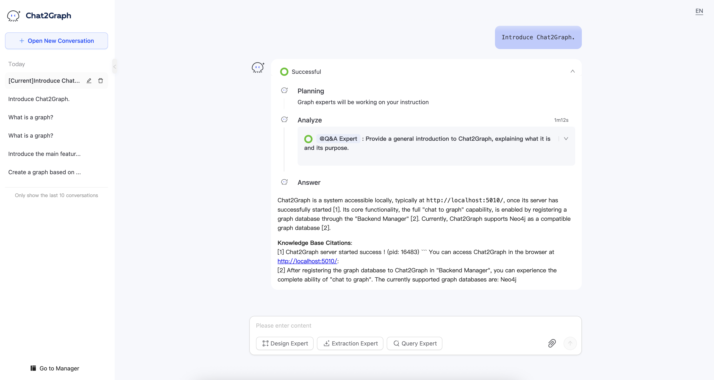

# Knowledge Base

The knowledge base in Chat2Graph is divided into two parts for usage: the global knowledge base and the session knowledge base

+ **Global Knowledge Base**: The global knowledge base stores the foundational knowledge for the entire agent system. Any session can access knowledge from the global knowledge base.
+ **Session Knowledge Base**: The session knowledge base stores private knowledge related to the current session. It is one-to-one mapped to a session. During the current session, only the corresponding session knowledge base is accessed, and interference from other sessions' knowledge bases is blocked.

The knowledge base module of Chat2Graph is designed to support multi-source and multi-type knowledge base systems. Currently integrated knowledge base systems include:

+ **DB-GPT Vector Knowledge Base**: A vector knowledge base based on ChromaDB. During retrieval, it matches the most relevant document chunks based on vector similarity.
+ **DB-GPT Graph Knowledge Base**: A graph knowledge base based on TuGraph-DB. During retrieval, it matches subgraphs and community summaries related to the query within the knowledge graph.

## Operation Workflow

### Knowledge Base Configuration

Chat2Graph uses the vector knowledge base by default. To specify a different knowledge base type, add the following configuration items to the `.env` file before start:

#### Vector Knowledge Base Configuration

```toml
# Vector Knowledge Base
KNOWLEDGE_STORE_TYPE=VECTOR
```

#### Graph Knowledge Base Configuration

```toml
# Graph Knowledge Base
KNOWLEDGE_STORE_TYPE=GRAPH
# Host of TuGraph-DB
GRAPH_KNOWLEDGE_STORE_HOST=127.0.0.1
# Port of TuGraph-DB
GRAPH_KNOWLEDGE_STORE_PORT=17687
```

### Knowledge Base Documents Loading

Click the card of the global knowledge base or session knowledge base.


Click the "New" button.


Select the files to add to the knowledge base.


Configure knowledge base loading configuration(currently supports modification of the `chunk_size` ).


After successful file addition, the files will be displayed in the knowledge base management page. Click "Delete" to remove files from the knowledge base.


### Editing the Session Knowledge Base

The top-right corner of the session knowledge base card provides functions to edit, clear the knowledge base, and return to the corresponding session.


The "Edit" function allows modification of the knowledge base name and description.


### Knowledge Base-Assisted Q&A

After adding knowledge to the knowledge base, Chat2Graph can answer domain-specific questions that the base model cannot handle using the knowledge base's domain knowledge. It also lists references to original documents from the knowledge base. Below is an example response to the question "Introduce Chat2Graph.":


