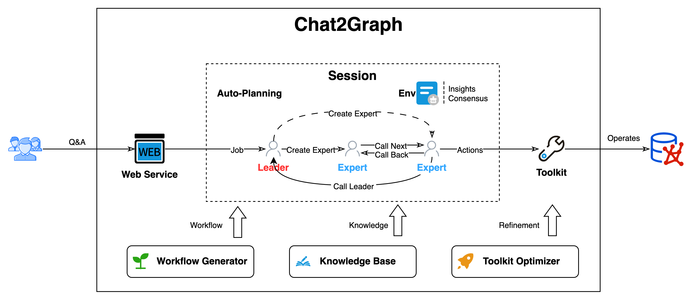

# Overview

Chat2Graph is a **Graph Native Agent System** focused on the exploration and implementation of "Graph + AI" technology. It leverages the interpretability of symbolism and the autonomous learning capabilities of connectionism to explore the deep integration of graph computing and artificial intelligence technologies.

## 1. Design Philosophy

In agent design, "Graph Native" is an innovative architectural concept that deeply integrates graph computing technology with AI, i.e., "Graph + AI."

On one hand, the system utilizes an Agentic System to achieve autonomy and intelligence in graph systems, lowering the barrier to entry and enhancing the user experience—"AI for Graph."

On the other hand, it leverages the associative modeling strengths of graphs to enhance key agent capabilities such as reasoning, memory, and tool usage, reducing model hallucinations and improving generation quality—"Graph for AI."

## 2. Capabilities

The current system offers the following core capabilities:

* **Architecture**: Single-active-many-passive hybrid architecture.
* **Reasoning**: Dual-LLM reasoning engine combining fast & slow thinking.
* **Planning**: CoA-style task decomposition and graph planner.
* **Memory**: Hierarchical memory system.
* **Knowledge**: Supports VectorRAG and GraphRAG.
* **Toolkit**: Organizes tools and actions using graph structures.
* **SDK**: Agent construction and service APIs.
* **Configurability**: One-click agent configuration.
* **Integration**: Supports Neo4j and TuGraph databases.
* **UI**: Supports RestfulAPI and Web UI.
* **Intervenability**: Supports task suspension and resumption.
* **Persistency**: Job state and message persistence.

## 3.  Architecture

Chat2Graph adopts a "[Single-Active-Many-Passive](https://arxiv.org/abs/2409.11393)" hybrid agent architecture, building a task execution system driven by a single Leader agent with multiple Expert agents collaborating.

Key components of the system include:

* **Graph System**: Provides a unified abstraction for graph systems, managed via [GraphDB Service](../graph_db/graph-db.md), with support for future extensions to more graph computing systems.
* **AI System**: Abstracts AI infrastructure, such as agent frameworks, RAG, memory tools, and model service tools, offering foundational agent capabilities and ecosystem expansion.
* **Storage**: Stores persistent agent data, including metadata, memory, knowledge, and files.
* **[Reasoner](reasoner.md)**: Encapsulates LLM services, enhances reasoning, and provides tool invocation capabilities.
* **[Workflow](workflow.md)**: Handles internal operator orchestration and SOP abstraction, defining agent workflows.
* **[Memory](memory.md)**: Builds a hierarchical knowledge refinement system for information storage and retrieval, including memory, knowledge, insights, and consensus.
* **[Toolkit](toolkit.md)**: Describes tool and action relationships using graphs, enabling automated tool management and recommendation.
* **[Agent](agent.md)**: A unified abstraction for agent execution units, using role definitions (Profile) to describe responsibilities and workflows to define processes. Includes [Leader](leader.md) and Expert agents.
* **Automation**: Abstracts agent automation capabilities, embodying the "Less Structure" philosophy. Includes automated task planning, workflow generation, toolkit optimization, knowledge refinement, and resource scheduling.
* **Integrability**: Offers Web UI, Restful API, and [SDK](sdk.md) integration, with YAML-based one-click agent configuration for easy developer integration.

## 4. Deployment

Chat2Graph intelligently transforms user natural language instructions into precise, automated steps for graph data construction, processing, algorithm application, and iterative optimization. This significantly lowers the technical barrier for complex graph analysis, enabling non-technical users to leverage the expressive power of graphs for deep exploration and knowledge discovery.

Current applicable scenarios include:

- **Knowledge Graph Construction & Interactive Exploration**: Automatically builds domain-specific knowledge graphs from vast text, reports, or diverse data sources, allowing users to query, analyze, and visualize via natural language.
- **Deep Analysis of Complex Relationship Networks**: Reveals deep connections, key nodes, and community structures in fields like social network analysis, financial risk control (e.g., anti-fraud, related transaction identification), supply chain optimization, bioinformatics (e.g., protein interaction networks), and intelligence analysis.
- **Intelligent Q&A & Decision Support**: Provides context-aware advanced Q&A services based on dynamically built and updated knowledge graphs, delivering data-driven insights for complex decision-making.
- **High-Quality Reasoning & Content Generation**: Deeply integrates symbolic strengths for high-quality task planning and memory recall, enabling precise tool invocation. We will continue to improve this capability.