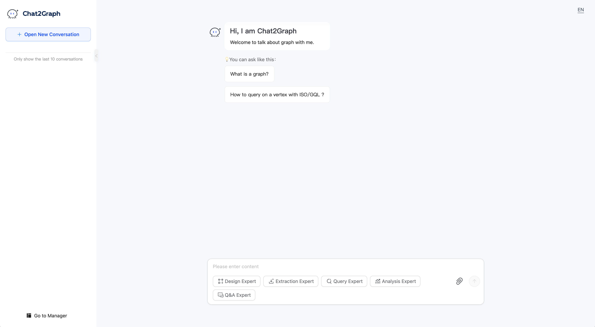

# User Manual

Welcome to Chat2Graph! This application allows you to interact with graph experts through a 
chat interface to perform various graph-related tasks, including design, extraction, query,
analysis and Q&A. This manual will guide you through the features and usage of the Chat2Graph.

# Index

* [Chat](./chat/chat.md)

* [Graph Database](./graph_db/graph-db.md)

* [Knowledge Base](./knowledge/knowledge-base.md)

<!-- Add links to other module documentation as they become available -->
<!--
### Agent
### DAL
### Env
### Memory
### Model
### Reasoner
### SDK
### Service
### Toolkit
### Workflow
-->

<!-- Add links to plugin documentation as they become available -->
