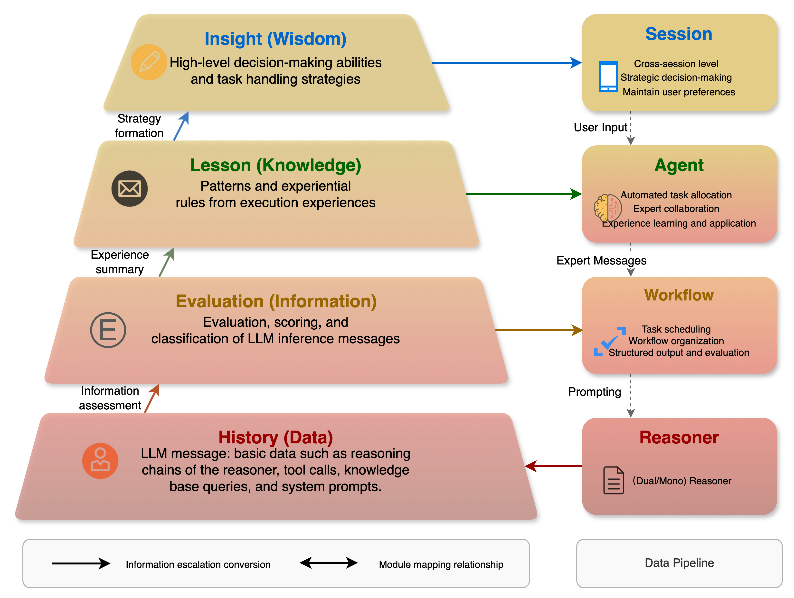

# 记忆系统

## 1. 介绍

记忆（Memory）系统是 Chat2Graph 中负责信息存储、检索和管理的核心组件。通过多层级记忆系统设计，定义了从原始数据逐步提炼到高层次的智慧洞察的过程，如记忆存储、信息评估、经验提取和洞察生成，为整个 Chat2Graph 系统提供持久化的学习和适应能力，提升系统的整体智能水平。

> 记忆系统的功能当前还在持续建设中，这里重点介绍系统的设计理念，希望感兴趣的您加入社区一起共建。

## 2. 设计

### 2.1. 分层记忆架构

参考 [DIKW](https://en.wikipedia.org/wiki/DIKW_pyramid) 金字塔模型，Chat2Graph 将记忆分层抽象为四个等级：

| 层级 | 名称 | 描述 | 存储内容 | 典型用途 |
|:----:|:-----|:-----|:---------|:---------|
| **L0 (D)** | **History** | 消息历史层 | 推理消息、工具调用记录、系统日志等 | 完整追溯、调试分析、基础检索 |
| **L1 (I)** | **Evaluation** | 过程评估层 | 评估结果、性能指标、状态分类等 | 质量控制、错误诊断、模式识别 |
| **L2 (K)** | **Lesson** | 经验总结层 | 经验规则、最佳实践、领域知识等 | 决策支持、策略优化、技能传承 |
| **L3 (W)** | **Insight** | 高维洞察层 | 高层决策模式、战略洞察等 | 高维决策、用户偏好、全局优化 |

### 2.2. 分层知识管理

不同记忆层级存取的内容差异极大，为了简化描述，这里统一称之为「知识」。

  

对于传统记忆系统来说，一般采用单一的存储架构，主要解决知识生产和知识消费的问题。相比而言，分层记忆系统引入了多级的知识抽象，从更精细的粒度对知识进行管理。总的来看包含三个方面：

* **知识精练**（Knowledge Refinement）：原始知识经过逐级的处理、分析、抽象、压缩，形成更高层次的知识，扩展知识生产的能力。
* **知识下钻**（Knowledge Drilling）：在使用高维知识的同时，还可以按需下钻低维知识，让推理上下文粗中有细，强化知识消费的能力。
* **知识延拓**（Knowledge Expansion）：表示同层级知识关联的构建和召回，通过特定方法丰富知识上下文。典型代表是 RAG（检索增强生成）。

## 3. 记忆系统扩展

广义上，基于分层记忆的设计，可以更好地兼容知识库（Knowledge Base）和环境（Environment）的概念。换言之，从技术实现角度来看，记忆系统、知识库和环境的架构可以统一。

## 3.1. 知识库

一般的，知识库被看作外部知识的「封闭式」存储仓库。为了提升知识召回的质量，RAG 框架多数情况在对知识库的外围技术做改进，比如查询重写、文档切分、重排序等等，反而忽略了知识内容自身的改进。当然，GraphRAG 可以看做一种相对早期的尝试。分层记忆系统的引入，为精细化的知识管理的提供了「开放式」的解决思路。

因此从某种意义上讲，「**知识库其实是记忆系统在垂类领域知识上的特化表达**」。当前 Chat2Graph 先初步地将 RAG 作为知识库的实现形式，待分层记忆架构完善后，将进一步把知识库整合进去。关于知识库的具体使用，可以参考[知识库](../cookbook/knowledgebase.md)文档。

## 3.2. 环境

环境指的是 Agent 执行过程中可交互的外部空间，Agent 可以通过工具操作感知环境变化，影响环境状态。本质上，「**环境可以被视为"当前时刻的外部记忆"，而记忆则是"历史时刻的环境快照"**」，这种同质性使得环境可以无缝地融入分层记忆模型中。Agent 通过工具感知的环境信息其实是 L0 层的原始数据，并可以进一步的提炼形成更高层次洞察（L1~L3）。反过来，记忆系统中经验积累会直接影响环境中的全局共识和高维洞察。

借助于「工具」这座桥梁，可以深层次地打通记忆系统与环境状态，构建智能体的「精神世界」与外部环境的「物理世界」的映射关系，即世界知识模型。

