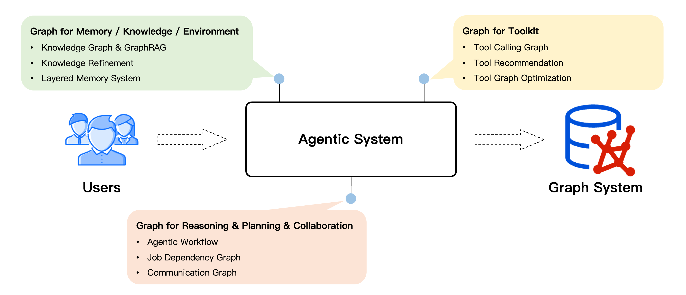

# 技术原理

Chat2Graph 是一个图原生（Graph Native）的智能体系统，聚焦于「图智互融」技术（Graph + AI）的探索与落地，充分发挥「符号主义」的可解释性与「连接主义」的自主学习的优势，探索图计算技术与人工智能技术的深度融合。

## 1. 设计理念

在智能体的设计中，「图原生」是一个新颖的架构理念，将图计算技术深度整合到人工智能技术中，即「Graph + AI」。

一方面，借助于智能体系统（Agentic System）实现图系统的自主化与智能化，降低用图门槛，提升图系统使用体验，即「AI for Graph」。

另一方面，借助于图的关联性建模优势，实现智能体的推理、记忆、工具使用等关键能力的增强，降低模型幻觉，提升生成质量，即「Graph for AI」。

## 2. 核心能力

当前系统提供的核心能力有：

* **架构**：单主动-多被动的混合架构。
* **推理**：快&慢思考结合的双LLM推理机。
* **规划**：CoA 式任务分解与图规划器。
* **记忆**：分层记忆系统。
* **知识**：支持 VectorRAG 和 GraphRAG。
* **工具**：利用图结构组织工具和行动。
* **SDK**：智能体构建与服务API。
* **配置**：一键配置智能体。
* **集成**：支持 Neo4j 和 TuGraph 图数据库。
* **界面**：支持 RestfulAPI 和 Web UI。
* **可干预**：支持任务的暂停和恢复。
* **持久化**：作业状态和消息的持久化。

## 3. 架构设计

Chat2Graph 整体采用了「[单主动-多被动](https://arxiv.org/abs/2409.11393)」（One-Active-Many-Passive）的混合智能体架构，构建了以单个 Leader 智能体驱动，多个 Expert 智能体协作的任务执行体系。

系统的核心组件有：

* **图系统层**：构建了面向图系统的统一抽象，使用 [Graph Database](../cookbook/graphdb.md) 服务统一管理，并支持未来更多图计算系统的扩展。
* **AI 系统层**：构建 AI 基础设施抽象，如智能体框架、RAG、记忆工具、模型服务工具等，提供智能体能力基建和生态扩展。
* **存储服务层**：存储智能体的持久化数据，包括元数据、记忆、知识、文件等。
* **[推理机](reasoner.md)**：提供 LLM 服务封装、推理增强、工具调用等基础能力。
* **[工作流](workflow.md)**：负责智能体内部的算子（Operator）编排与SOP抽象，定义智能体工作流程。
* **[记忆系统](memory.md)**：构建分层的知识精练体系，负责智能体系统的信息存储、检索，包括记忆管理、[知识库](../cookbook/knowledgebase.md)、环境等。
* **[工具库](toolkit.md)**：基于图谱的方式描述工具和智能体行动的关联关系，实现工具的自动化管理和推荐。
* **[智能体](agent.md)**：智能体系统执行单元的统一抽象，使用角色定义（Profile）描述工作职责，使用工作流描述工作流程。主要包括 [Leader](leader.md) 智能体和 Expert 智能体两大类型。
* **自动化**：系统智能体化能力的抽象，「Less Structure」理念的实践手段。包括自动的任务规划、工作流生成、工具库优化、知识精练、资源调度等能力。
* **系统集成**：提供 Web UI、Restful API、[SDK](sdk.md) 的集成方式，通过 YAML 一键配置智能体系统，方便开发者快速接入 Chat2Graph 的能力。

## 4. 部署形态

Chat2Graph 能够将用户的自然语言指令智能地转化为一系列精确、自动化的图数据构建、数据处理、算法应用和迭代优化的步骤。这极大地降低了用户进行复杂图分析的技术门槛，使得非技术背景的用户也能利用图的强大表达能力进行深度探索和知识发现。

