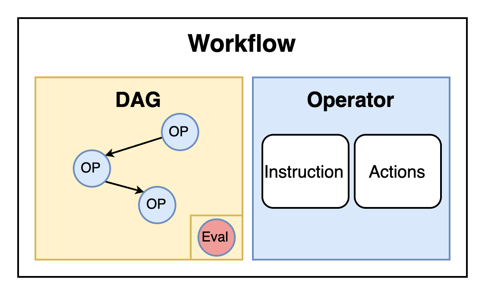

## 1. 介绍

工作流（Workflow）模块是 Chat2Graph 中 `Agent`（`Leader` 和 `Expert`）任务执行的核心组件。它负责编排和执行一系列定义好的 `Operator`（算子）。通过将多个 `Operator` 组织成一个有向无环图（DAG），`Workflow` 明确了这些算子之间的执行顺序和依赖关系。



每个 `Agent` 必须内置一个 `Workflow`，该 `Workflow` 规定了 `Agent` 为完成特定类型任务所应遵循的标准化流程（SOP）。此外，`Workflow` 模块支持集成一个可选的评估算子（`Evaluator`）。该评估算子在工作流执行完毕后启动，负责对结果进行评估，并可能生成反馈（`lesson`），供后续的 `Operator` 或 `Expert` 参考和使用。

算子（Operator）作为 `Workflow` 的基本执行单元，其职责是将一个具体的作业（`Job`）与执行该作业所必需的工具、动作以及相关的上下文信息（如：上游的 `Operator` 及 `Expert` 的输出、知识库信息、环境状态等）封装成一个可执行的 `Task` 对象。随后，`Operator` 将此 `Task` 提交给 `Reasoner` 模块进行处理，并最终返回执行结果。

`Operator` 的核心功能在于任务的准备与分发，而非直接执行复杂的逻辑运算或与外部工具进行交互。它依赖 `Reasoner` 完成推理和工具调用，从而实现了任务定义与任务执行之间的解耦。而评估算子（`Evaluator`）作为一种特殊的算子，其职责是对工作流的执行结果进行质量分析和状态判断，通过预定义的错误模式识别潜在问题，为整个工作流，甚至多代理系统的可靠性和自我纠错能力，提供关键的支撑。

## 2. 算子

### 2.1. 算子定义

`Operator` 的行为和能力通过 `OperatorConfig` 对象进行配置。这些配置共同决定了一个 `Operator` 实例的具体行为，使其能够针对特定任务阶段执行专门化的操作。

`OperatorConfig` 包含以下字段：

| 字段             | 描述                                                                                                                                                                                             |
| :--------------- | :----------------------------------------------------------------------------------------------------------------------------------------------------------------------------------------------- |
| `instruction`    | 给 `Reasoner` 的指令。用于描述 `Operator` 的角色、需要完成的任务目标、执行任务时的注意事项以及期望的输出风格等。`Reasoner` 会根据这个指令来理解任务并规划执行步骤。不可以为空。                                                                 |
| `actions`        | 一个 `Action` 对象列表，定义了该 `Operator` 在执行任务时可以调用的一系列动作。`Operator` 会基于这些 `Action`，通过 `ToolkitService` 获取推荐的工具 (`Tool`) 和更具体的动作，供 `Reasoner` 选择和执行。                                                               |
| `output_schema`  | 定义 `Operator` 执行完成后期望输出内容的格式和结构。这通常是一个 YAML、JSON 格式或者自然语言的字符串描述，用于指导 `Reasoner` 生成符合预期的结构化输出。                                                                                             |
| `threshold`      | 在通过 `ToolkitService` 获取推荐工具和动作时使用的相似度或相关性阈值（只有当工具或动作与当前上下文的关联分数高于此阈值时，才会被推荐）。                                                                                                     |
| `hops`           | 在 `Toolkit` 的图结构中进行工具和动作推荐时，探索的"跳数"或深度。表示从当前 `Action` 出发，在图谱中查找相关联的 `Action` 或 `Tool` 时，最多允许经过多少层关系。                                                                                             |

### 2.2. 执行流程

当 `Operator` 被调用执行时，其工作流程如下：

1. **构建任务**:
    * 接收一个 `Job` 对象，其中包含任务的目标和上下文。
    * 工具 (`Tool`) 和动作 (`Action`)。
    * 整合来自先前算子或其他 `Expert` 的输出信息 (`WorkflowMessage`)。
    * 检索知识库中的知识，获取环境洞察信息（在建）。
    * 将所有这些信息以及经验教训 、文件描述符等组装成一个 `Task` 对象。
    
2. **执行任务**:
    * 将构建好的 `Task` 对象传递给 `Reasoner`，执行推理。
    * 返回 `WorkflowMessage`，供工作流中的后续步骤使用。


### 2.3. 评估算子

评估算子（`Evaluator`）是工作流中的特殊算子，用于对工作流的执行结果进行质量评估和状态分类。

工作流执行结果分为四种状态。优先级表示在多种错误模式同时存在时的判断顺序，高优先级的状态会优先被评估算子选择。

| 状态                          | 优先级 | 描述                                                   | 典型场景                                         |
| :---------------------------- | :----: | :----------------------------------------------------- | :----------------------------------------------- |
| `EXECUTION_ERROR`             | **最高** | 执行过程或推理逻辑存在缺陷，与输入质量无关             | 逻辑矛盾、违反指令、工具调用失败                 |
| `INPUT_DATA_ERROR`            |   高   | 输入数据问题导致无法完成任务，执行本身正确             | 数据缺失、格式错误、结构异常                     |
| `JOB_TOO_COMPLICATED_ERROR`   |   中   | 任务过于复杂，超出当前能力范围                         | 解决一些超出算子能力范围的任务           |
| `SUCCESS`                     | **最低** | 任务成功完成，结果合理满足目标要求                     | 正常完成、输出正确、逻辑清晰                     |

评估算子返回的 `WorkflowMessage` 的结构如下：

```json
{
  "scratchpad": "被评估的算子的输出内容",
  "status": "SUCCESS | EXECUTION_ERROR | INPUT_DATA_ERROR | JOB_TOO_COMPLICATED_ERROR",
  "evaluation": "详细评估说明",
  "lesson": "经验教训和改进建议"
}
```

## 3. 工作流

工作流是由多个算子按照特定的依赖关系组织而成的有向无环图（DAG）结构。在这个图中，每个节点代表一个算子，边表示算子之间的数据流向和执行顺序。工作流的设计使得数据能够从一个算子流向下一个算子，形成一个完整的任务处理管道。除了主要的执行算子外，工作流还可以在末尾集成一个可选的评估算子，用于对整个工作流的输出结果进行质量评估和状态判断。


### 3.1. 构建

当 `Workflow` 的 `execute` 方法首次被调用时，它会触发一个构建工作流的方法（由线程锁保护，确保只构建一次）。此方法负责将 `_operator_graph` 和 `_evaluator` 转换成一个具体的可执行工作流实例。例如，`DbgptWorkflow`，默认由 DB-GPT AWEL (Agentic Workflow Expression Language) 实现。


### 3.2. 执行

构建完成后，`Agent` 调用 `Workflow`，传入当前任务（`Job`）、`Reasoner`、来自先前 `Expert` 的输出（`workflow_messages`）以及可能的经验教训（`lesson`）。


| 参数                | 描述                                                                                                                                                                                                                                                           |
| :------------------ | :------------------------------------------------------------------------------------------------------------------------------------------------------------------------------------------------------------------------------------------------------------- |
| `job`               | 当前需要执行的任务对象。它包含了任务的目标、上下文信息、会话 ID等。对于 `Leader` 内的 `Workflow`，这通常是一个原始任务或一个需要进一步分解的子任务。对于 `Expert` 内的 `Workflow`，这通常是一个具体的子任务。                                                                       |
| `workflow_messages` | 一个可选的 `WorkflowMessage` 对象列表。这些消息通常包含了**同一 `Agent` 内部**，当前 `Operator` 的前序 `Operator`(s) 的输出。这些输出可以作为当前 `Operator` 执行的上下文或输入数据。对于工作流中的第一个 `Operator`，此参数通常为 `None`。                                                 |
| `lesson`            | 一个可选的字符串，代表从先前或其他 `Agent`（通常是后续 `Agent` 对当前 `Agent` 输出的评估反馈，或者重试时产生的 `lesson`）执行中获得的经验教训。这个 `lesson` 可以指导当前 `Workflow` 的行为，帮助它们更好地完成任务或避免之前的错误。例如，如果一个 `Expert` 返回了 `INPUT_DATA_ERROR`，它可能会附带一个 `lesson` 给前一个 `Expert`，指出输入数据的问题。 |


### 3.3. 返回

执行完毕后，返回一个 `WorkflowMessage` 对象。该对象包含了工作流的执行状态（`WorkflowStatus`）、评估结果（如果配置了 `Evaluator`），以及可能的 `lesson`。若未配置 `Evaluator`，默认情况下，成功执行的 `Workflow` 会将状态设置为 `SUCCESS`。

## 4. API 设计

### 4.1. 算子 API

| 方法签名                                                                                                                               | 描述                                                                                                                                                                                                                            |
| :------------------------------------------------------------------------------------------------------------------------------------- | :------------------------------------------------------------------------------------------------------------------------------------------------------------------------------------------------------------------------------ |
| `execute(self, reasoner: Reasoner, job: Job, workflow_messages: Optional[List[WorkflowMessage]] = None, previous_expert_outputs: Optional[List[WorkflowMessage]] = None, lesson: Optional[str] = None) -> WorkflowMessage` | 执行操作。首先调用 `_build_task` 方法构建一个 `Task` 对象，然后将该 `Task` 交给传入的 `Reasoner` 进行推理和执行。最后，将 `Reasoner` 的执行结果封装成 `WorkflowMessage` 并返回。                                                              |
| `get_knowledge(self, job: Job) -> Knowledge`                                                                                           | 从知识库中获取与当前 `Job` 相关的知识。它会根据 `Job` 的目标和上下文构造查询，并通过 `KnowledgeBaseService` 进行检索。                                                                                                             |
| `get_env_insights(self) -> Optional[List[Insight]]`                                                                                    | 获取环境洞察信息。目前此方法返回 `None`，是一个待实现的功能。                                                                                                                                                                     |
| `get_id(self) -> str`                                                                                                                  | 获取 `Operator` 的唯一标识符，该 ID 来自其配置对象 `OperatorConfig`。                                                                                                                                                               |

### 4.2. 工作流 API

| 方法签名                                                                                                                               | 描述                                                                                                                                                                                                                            |
| :------------------------------------------------------------------------------------------------------------------------------------- | :------------------------------------------------------------------------------------------------------------------------------------------------------------------------------------------------------------------------------ |
| `execute(self, job: Job, reasoner: Reasoner, workflow_messages: Optional[List[WorkflowMessage]] = None, lesson: Optional[str] = None) -> WorkflowMessage` | 执行工作流。接收任务、推理器、先前专家的输出和经验教训，返回工作流执行结果。                                                                                                                                                           |
| `add_operator(self, operator: Operator, previous_ops: Optional[List[Operator]] = None, next_ops: Optional[List[Operator]] = None)`    | 向工作流中添加一个算子，并可以指定其前驱和后继算子，从而构建算子图。                                                                                                                                                                       |
| `remove_operator(self, operator: Operator) -> None`                                                                                    | 从工作流中移除指定的算子。                                                                                                                                                                                                         |
| `set_evaluator(self, evaluator: Evaluator)`                                                                                         | 为工作流设置一个评估算子 (`Evaluator`)。该算子会在工作流主要算子执行完毕后运行，对结果进行评估。                                                                                                                                                 |
| `get_operator(self, operator_id: str) -> Optional[Operator]`                                                                           | 根据算子 ID 获取工作流中的算子实例。                                                                                                                                                                                                 |
| `get_operators(self) -> List[Operator]`                                                                                                | 获取工作流中所有的算子实例列表。                                                                                                                                                                                                   |
| `update_operator(self, operator: Operator) -> None`                                                                                    | 更新工作流中已存在的算子。算子 ID 必须匹配。                                                                                                                                                                                             |

## 5. 使用示例

本节提供了如何通过代码直接构建和执行 `Operator`、`Evaluator` 以及 `DbgptWorkflow` 的示例。

* 算子 (Operator) 使用示例：
  * 初始化和执行一个基本的 `Operator`，包括配置指令、动作，并与 `Reasoner` 和 `ToolkitService` 交互。
  * 详情参见：`test/example/run_operator.py`

* 评估算子 (Evaluator) 使用示例:
  * 配置和使用 `Evaluator` 来评估先前操作的输出，并生成反馈。
  * 详情参见：`test/example/run_eval_operator.py`

* 工作流 (DbgptWorkflow) 使用示例:
  * 允许通过代码直接构建和执行一个 `DbgptWorkflow`，包括添加 `Operator`、设置 `Evaluator` 以及执行工作流。
  * 详情参见：`test/example/run_workflow.py`
